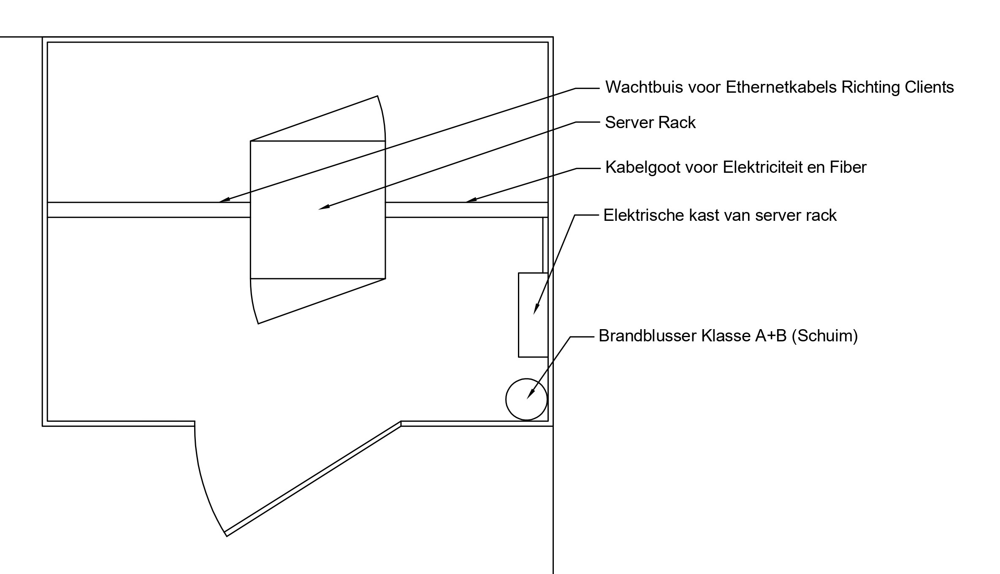
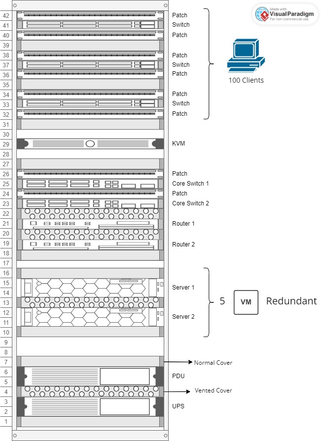
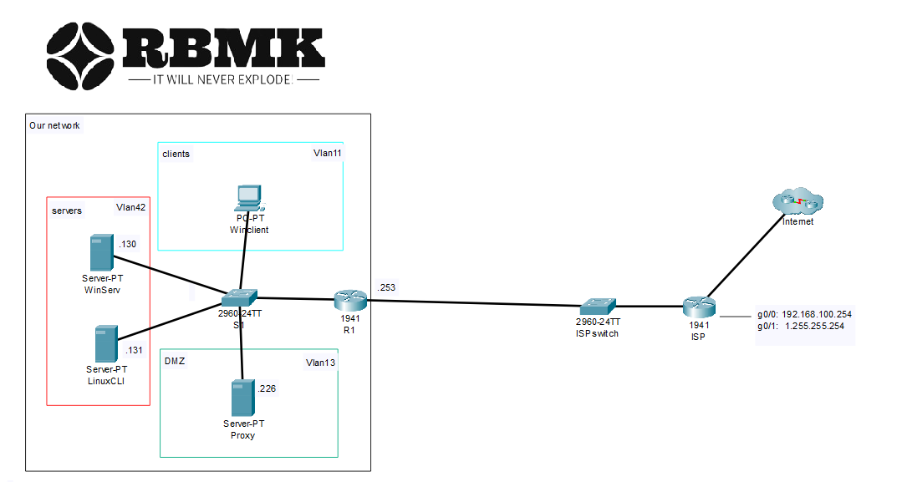

# Installatieplan: RBMK - Server room

Overview layout Server Room

## Voorbereiding

Alvorens men de server rack kan beginnen installeren zijn er een aantal zaken die moeten gebeurd zijn.
Deze houden in:

### HVAC (Heating Ventilation & Airconditioning)

- HVAC geïnstalleerd met overdruk in de server room
  - Hierdoor kan men stof uit de server room houden
  - Server room is ook onder klimaatcontrole
  - Deze is in het plafond bevestigd

### Aanbouw

- De muren en plafond van de server room zijn geïsoleerd met geluids- en brandwerend isolatiemateriaal

  - Optie Inbouw:
    - Plafond: bv Isomat KE14
  - Optie Opbouw:
    - Muren en plafond:
      - bv [FLAT Tec Plus (aixFoam)](https://www.aixfoam.nl/akoestische-schuimstof-met-plat-oppervlak-sh0011-mh)
      - bv [Flamex Basic](<(https://www.akoestiekwinkel.be/flamex-basic-akoestische-platen)>)

- Er zijn wachtbuizen voorzien in de muren en vloer, vertrekkende van de centrale server room naar andere afdelingen

  - Voorzien van guide-cables

- Er is een elektrische kast in de server room voorzien

### Elektriciteit

- Er is een hoofdzekering en verliesstroomschakelaar voorzien
- Er is een aanduiding van gevaar door mogelijke UPS(sen) in gebruik

- Er is een voedingslijn getrokken van de elektrische kast naar het midden van de kamer / aanduiding plaats rack

  - Voedingslijn is in wachtbuis
  - 230V
  - Er is een zekering van 20A aanwezig voor de serverrack, die een piekstroom van 16A kan trekken

- Voor veiligheid is er in de server room een CO2-brandblusser 5kg voorzien
  - Deze is in staat om elektrische brandhaarden te blussen tot 1000 volt op 1 meter afstand
- De noodschakelaar is aan de buitenkant van de elektrische kast bevestigd voor snelle afsluiting
  - Voorzien van reset contact

### Fiber

- Er is een fiber kabel getrokken naar het midden van de kamer / aanduiding plaats rack
- Ter verduidelijking van de 4G-backup optie in het fiber-abonnement
  - Dit is een module in de modem die bij uitval va nde fiber wordt geactiveerd om gedurende de panne het internet te overbruggen.

## Eigen installatie

### Server Rack

Overzicht layout server rack

#### Voorbereiding

- Server rack is vast verankerd aan de grond

#### Opvulling

Men gaat ervan uit dat de server rack wordt opgevuld van boven naar beneden. (Rij 42 naar 1)

#### Artikelen

| Volgnummer | Artiken           | Beschrijving                                                                                           | Aantal |
| ---------- | ----------------- | ------------------------------------------------------------------------------------------------------ | ------ |
| 1          | Patchport-board   | Bord voor een ordelijke aansluiting twee toestellen                                                    | 7      |
| 2          | Switch            | Standaard switch voor clients                                                                          | 3      |
| 3          | Rack cover        | sluit rack rij af om kabels te verbergen/beschermen                                                    | 9      |
| 4          | KVM               | Monitor met keyboard voor directe connectie naar server/router/switch, voornamelijk voor noodsituaties | 1      |
| 5          | Core switch     | Verbind servers, andere switchen met de routers                                                        | 2      |
| 6          | Vented rack cover | sluit rack rij af om kabels te verbergen/beschermen en zorgt voor ventilatie                           | 4      |
| 7          | Router            | -                                                                                                      | 2      |
| 8          | Server            | -                                                                                                      | 2      |
| 9          | PDU               | Power Distribution Unit                                                                                | 1      |
| 10         | UPS               | Uninterruptible Power Supply, noodbatterij                                                             | 1      |

Concreet betekent dit dat men op volgende rijen hun artikel plaatst:

- Rij 42: Patchport-board [1]
- Rij 41: Standaard switch [2]
- Rij 40: Patchport-board [1]
- Rij 38: Patchport-board [1]
- Rij 37: Standaard switch [2]
- Rij 36: Patchport-board [1]
- Rij 34: Patchport-board [1]
- Rij 33: Standaard switch [2]
- Rij 32: Patchport-board [1]
- Rij 29: KVM [4]
- Rij 26: Patchport-board [1]
- Rij 25: Core switch 1 [5]
- Rij 24: Patchport-board [1]
- Rij 23: Core switch 2 [5]
- Rij 21: Router 1 [7]
- Rij 219: Router 2 [7]
- Rij 14 en 15: Server 1 [8]
- Rij 11 en 12: Server 2 [8]
- Rij 5 en 6: PDU [9]
- Rij 2 en 3: UPS [10]

#### Aansluiting

- Voor de aansluiting kan men de patchpoorten verbinden met de bovenste rij van de switch er onder of de onderste rij van de switch erboven.
- De kabel die dan aan de andere kant van de patchpoorten zitten worden via de wachtbuis naar de clients getrokken.
- __*Opm: Verder aansluiting worden onder netwerk uitgeklaard.*__

- De fiber wordt zowel bevestigd op router 1 als router 2
- De routers worden verbonden met de core switch

- Via de patchpoorten worden de servers & standaard switchen verbonden met de core switch

- De UPS en PDU worden aangesloten en alle andere stroomeisende toestellen worden hiermee verbonden.

Na de Aansluiting wordt er op volgende rijen:

- Een gewone cover [3] geplaatst
  - Rij 1, 7, 10, 16, 18, 27, 31, 35, 39
- een vented cover [6] geplaatst
  - Rij 4, 13, 20, 22

### Netwerk-installatie

Netwerktopologie / netwerkschema

#### Connections

|Bron naam|Bron poort|Doel naam|Doel poort|
|--|--|--|--|
|Hoofdrouter|Te0/1|Core switch|Te0/1|
|Core Switch 1|Gig0/2|Standaard switch 1|Gig0/1|
|Core Switch 1|Gig0/3|Standaard switch 2|Gig0/1|
|Core Switch 1|Gig0/4|Standaard switch 3|Gig0/1|
|Core Switch 2|Gig0/2|Standaard switch 1|Gig0/2|
|Core Switch 2|Gig0/3|Standaard switch 2|Gig0/2|
|Core Switch 2|Gig0/4|Standaard switch 3|Gig0/2|
|Core Switch 1|Gig0/12|Server 1|NIC-poort 1|
|Core Switch 2|Gig0/12|Server 1|NIC-poort 2|
|Core switch 1|Gig0/13|Server 2|NIC-poort 1|
|Core switch 2|Gig0/13|Server 2|NIC-poort 2|

#### Configuration

De configuratie wordt geupload naar de corresponderde apparatuur via de TFTP-server

### Server Deployment

Volgende servers zijn virtual machines die elk draaien op de fysieke servers (Redundante opbouw):

- Windows Server
  - Installatie-script
    - bevat:
      - Standard-deployment
      - Active Directory
      - DNS
      - DHCP

- Almalinux Server (Database)
  - Vagrant deployment-script
- Almalinux Server (Proxy)
  - Vagrant deployment-script
- Almalinux Server (Web)  
  - Vagrant deployment-script
- AlmaLinux Server (TFTP)
  - Vagrant deployment-script
