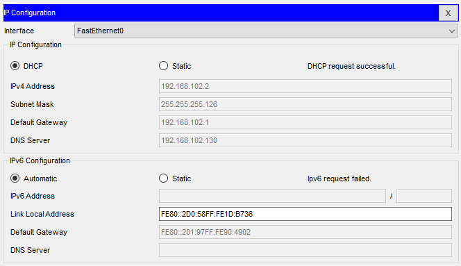
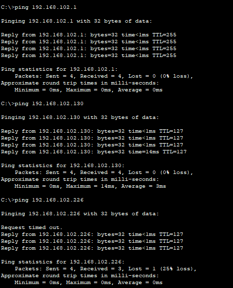
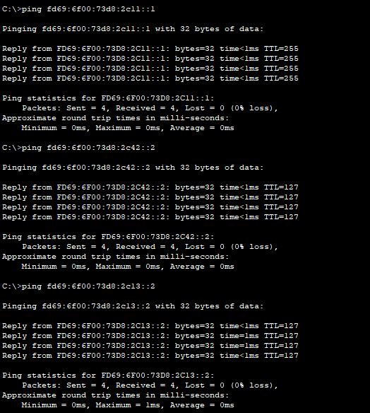

# Testplan

- Auteur(s) testplan: Wout De Temmerman

## Test: DHCP voor verdeling van ip addressen

Testprocedure:
(in packet tracer)

1. selecteer client pc
2. verander bij ip-config de configuratie naar static en dan terug naar dhcp voor zowel ipv4 en ipv6
3. verifieer dat er een ip address word voorzien door dhcp server

Verwacht resultaat:

- Een ip adress is toegekend aan de client (waarscijnlijk: 192.168.102.2)
- Dit moet bij elke uitvoer lukken
- Apipa is niet toegepast
- Voor IPv6 lukt dit niet, is NIET mogelijk voor PT

<!-- Voeg hier eventueel een screenshot van het verwachte resultaat in. -->

## Test: Connectiviteit en pings IPv4

Testprocedure:

1. Indien dhcp niet werkt: static address: 192.168.102.2 255.255.255.128
2. Open command prompt
3. Voer een `ping` uit naar: 192.168.102.1, 192.168.102.130, 192.168.102.226 (en 1.1.1.1 via router)
4. Voer een `trace route` uit naar: 192.168.102.1, 192.168.102.130 en 192.168.102.226

Verwacht resultaat:

- Minimum 1 ping werkt bij eerste keer uitvoeren
- Alle pings werken na 2e en verdere uitvoeren
- Tracert geeft geen destination unreachable

<!-- Voeg hier eventueel een screenshot van het verwachte resultaat in. -->

## Test: Connectiviteit en pings IPv6

Testprocedure:

1. Indien dhcp niet werkt: statish address: fd69:6f00:73d8:2c11::2/64
2. Open command prompt
3. Voer een ping uit naar: fd69:6f00:73d8:2c11::1, fd69:6f00:73d8:2c42::2, fd69:6f00:73d8:2c13::2
4. Voer een tracert uit naar: fd69:6f00:73d8:2c11::1, fd69:6f00:73d8:2c42::2, fd69:6f00:73d8:2c13::2

Verwacht resultaat:

- Minimum 1 ping werkt bij eerste keer uitvoeren
- Alle pings werken na 2e en verdere uitvoeren
- Tracert geeft geen destination unreachable

<!-- Voeg hier eventueel een screenshot van het verwachte resultaat in. -->

