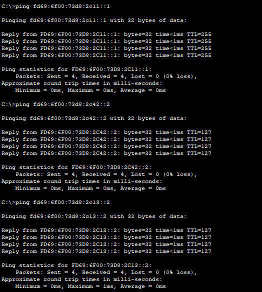

# Testplan

- Auteur(s) testplan: Wout De Temmerman

## !Preventieve Controle!

Controleer dat bij zowel winserv1 en winserv2 de DHCP-service juist staat geconfigureerd
-> Packet Tracer durft deze aan te passen

Config voor Winserv1 zou moeten zijn:

- `Start IP Address: 192.168.102.2`
- `Subnet Mask: 255.255.255.128`
- `Maximum Number of Users: 60`

Config voor Winserv2 zou moeten zijn:

- `Start IP Address: 192.168.102.63`
- `Subnet Mask: 255.255.255.128`
- `Maximum Number of Users: 60`

## Test: DHCP voor verdeling van ip addressen

Testprocedure:
(in packet tracer)

1. Selecteer Winclient-1 | Winclient-2 | Winclient-3
2. Verander bij ip-config de configuratie naar static en dan terug naar dhcp voor het IPv4-adress
3. Verifieer dat er een ip address word voorzien door dhcp server

Verwacht resultaat:

- Een ip adress is toegekend aan de client (waarscijnlijk: 192.168.102.2 of 192.168.102.64)
- Dit moet bij elke uitvoer lukken
- Apipa is niet toegepast
- Voor IPv6 lukt dit niet, is NIET mogelijk voor PT

<!-- Voeg hier eventueel een screenshot van het verwachte resultaat in. -->

## Test: Connectiviteit en pings IPv4

Testprocedure:

1. Indien dhcp niet werkt: static address: 192.168.102.2 255.255.255.128
2. Open command prompt
3. Voer een `ping` uit naar: 192.168.102.1, 192.168.102.130, 192.168.102.226 (en 1.1.1.1 via router)
4. Voer een `trace route` uit naar: 192.168.102.1, 192.168.102.130 en 192.168.102.226

Verwacht resultaat:

- Minimum 1 ping werkt bij eerste keer uitvoeren
- Alle pings werken na 2e en verdere uitvoeren
- Tracert geeft geen destination unreachable

<!-- Voeg hier eventueel een screenshot van het verwachte resultaat in. -->

## Test: Connectiviteit en pings IPv6

Testprocedure:

1. Indien dhcp niet werkt: statish address: fd69:6f00:73d8:2c11::2/64
2. Open command prompt
3. Voer een ping uit naar: fd69:6f00:73d8:2c11::a:1, fd69:6f00:73d8:2c42::2, fd69:6f00:73d8:2c13::2
4. Voer een tracert uit naar: fd69:6f00:73d8:2c11::1, fd69:6f00:73d8:2c42::2, fd69:6f00:73d8:2c13::2

Verwacht resultaat:

- Minimum 1 ping werkt bij eerste keer uitvoeren
- Alle pings werken na 2e en verdere uitvoeren
- Tracert geeft geen destination unreachable

<!-- Voeg hier eventueel een screenshot van het verwachte resultaat in. -->

## Test: Redundantie van Routers en Switches

BELANGRIJK: NIET OPSLAAN NA DEZE TEST!

Testprocedure:

1. Verwijder enkele kabels binnen het netwerk (bij voorkeur enkele die 'groen' zijn)
2. Spoel de tijd binnen PT door tot de overgebleven kabels 'groen' kleuren
3. Voer de testen voor ping IPv4 en IPv6 opnieuw uit
4. Voer de test voor dhcp opnieuw uit

Verwacht resultaat:

- Na enkele keren proberen zouden de ping terug moeten werken
- De hosts blijven via dhcp een adres krijgen, ook bij volledige 'afsluiting' van een 'Fysieke Server'
