# Testrapport

- Uitvoerder(s) test: Maarten Adriaenssens
- Uitgevoerd op: 17/03/2024 22.31
- Github commit: c88f49

## !Preventieve Controle!

Controleer dat bij zowel winserv1 en winserv2 de DHCP-service juist staat geconfigureerd
-> Packet Tracer durft deze aan te passen

Config voor Winserv1 zou moeten zijn:

- `Start IP Address: 192.168.102.2`
- `Subnet Mask: 255.255.255.128`
- `Maximum Number of Users: 60`

Config voor Winserv2 zou moeten zijn:

- `Start IP Address: 192.168.102.63`
- `Subnet Mask: 255.255.255.128`
- `Maximum Number of Users: 60`

## Test: DHCP voor verdeling van ip addressen

Testprocedure:
(in packet tracer)

1. Selecteer Winclient-1 | Winclient-2 | Winclient-3
2. Verander bij ip-config de configuratie naar static en dan terug naar dhcp voor het IPv4-adress
3. Verifieer dat er een ip address word voorzien door dhcp server

Verkregen resultaat:

- Winclient-1 verkrijgt nieuw IP van 192.168.102.2 
- Winclient-2 verkrijgt nieuw IP van 192.168.102.6 
- Winclient-3 verkrijgt nieuw IP van 192.168.102.65 

<!-- Voeg hier eventueel een screenshot van het verkregen resultaat in. -->

Test geslaagd:

- [x] Ja
- [ ] Nee

Opmerkingen:

- Geen

## Test: Connectiviteit en pings IPv4

Testprocedure:

1. Indien dhcp niet werkt: static address: 192.168.102.2 255.255.255.128
2. Open command prompt
3. Voer een `ping` uit naar: 192.168.102.1, 192.168.102.130, 192.168.102.226 (en 1.1.1.1 via router)
4. Voer een `trace route` uit naar: 192.168.102.1, 192.168.102.130 en 192.168.102.226

Verkregen resultaat:

- Alle pings hebben een reply
- Alle trace routes voltooien binnen de 2 hops

<!-- Voeg hier eventueel een screenshot van het verkregen resultaat in. -->

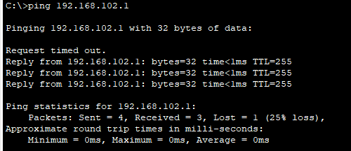
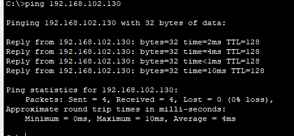
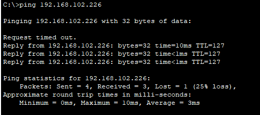

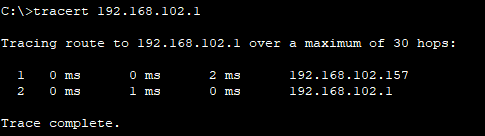

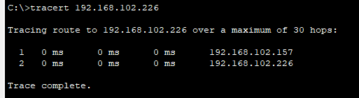

Test geslaagd:

- [x] Ja
- [ ] Nee

Opmerkingen:

- Geen

## Test: Connectiviteit en pings IPv6

Testprocedure:

1. Indien dhcp niet werkt: statish address: fd69:6f00:73d8:2c11::2/64
2. Open command prompt
3. Voer een ping uit naar: fd69:6f00:73d8:2c11::a:1, fd69:6f00:73d8:2c42::2, fd69:6f00:73d8:2c13::2
4. Voer een tracert uit naar: fd69:6f00:73d8:2c11::1, fd69:6f00:73d8:2c42::2, fd69:6f00:73d8:2c13::2

Verkregen resultaat:

- Alle pings hebben een reply
- Alle trace routes voltooien binnen de 2 hops

<!-- Voeg hier eventueel een screenshot van het verkregen resultaat in. -->

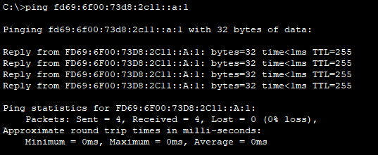
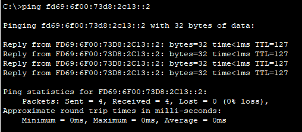
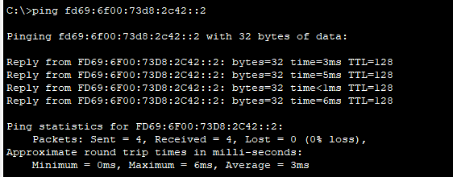

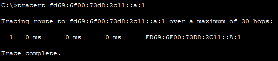
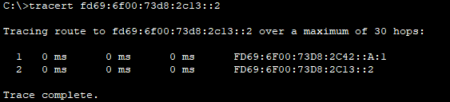
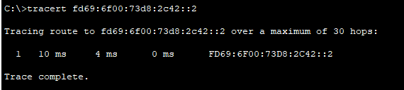

Test geslaagd:

- [x] Ja
- [ ] Nee

Opmerkingen:

- Geen

## Test: Redundantie van Routers en Switches

BELANGRIJK: NIET OPSLAAN NA DEZE TEST!

Testprocedure:

1. Verwijder enkele kabels binnen het netwerk (bij voorkeur enkele die 'groen' zijn)
2. Spoel de tijd binnen PT door tot de overgebleven kabels 'groen' kleuren
3. Voer de testen voor ping IPv4 en IPv6 opnieuw uit
4. Voer de test voor dhcp opnieuw uit

Verkregen resultaat:

- Pings voor zowel IPv4 als IPv6
- Trace Route slaagt in maximum 2 hops zijn doel te bereiken voor IPv4 en IPv6

<!-- Voeg hier eventueel een screenshot van het verkregen resultaat in. -->

Situatie voor verwijderen

Situatie na verwijderen

Controle op verwijderen

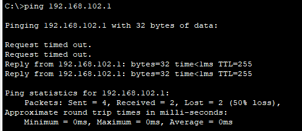
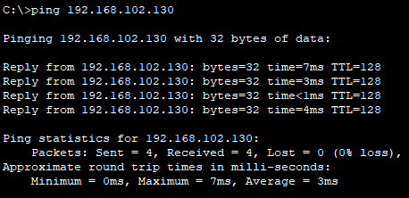
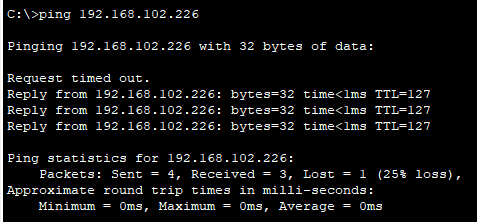

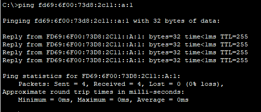
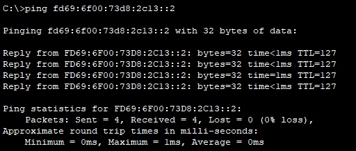
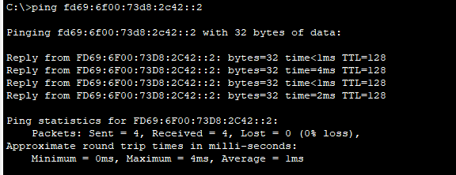

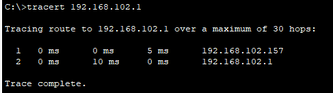
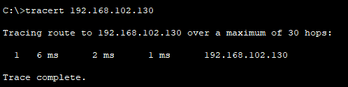
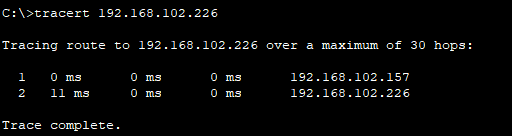

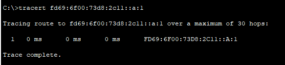
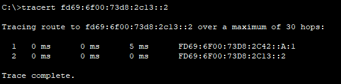
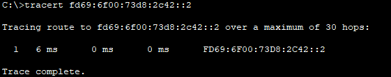

Test geslaagd:

- [x] Ja
- [ ] Nee

Opmerkingen:

- Geen
