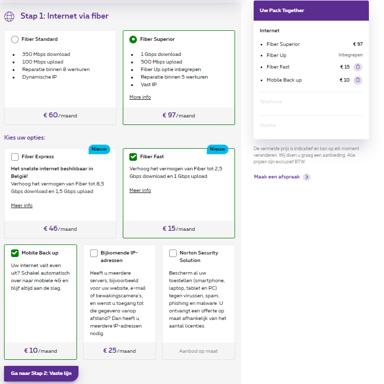

# Offerte

## Hardware

|Category|Item|Merk|Artikelcode (EAN)|Prijs/unit (excl.)|Aantal units|totale prijs (excl. btw)|totale prijs (incl. btw)|
|---|---|---|---|---|---|---|---|
|Netwerk|[Cisco C1300-24T-4X netwerk-switch](https://www.lasystems.be/nl/cisco-c1300-24t-4x)|Cisco|889728521543|€697,01|1|€697,01|€ 843,38|
|Netwerk|[Cisco - WS-C2960-48TT-L - Schakelaar](https://www.amazon.com.be/dp/B000CFX76M/ref=olp-opf-redir?aod=1&ie=UTF8&condition=new&creative=380345&creativeASIN=B000CFX76M)|Cisco|8826580440140|€386,31|3|€1.158,93|€1.467,00|
|Netwerk|[Cisco Catalyst C8300-1N1S- 4T2X](https://www.redshell.nl/cisco-catalyst-c8300-1n1s-4t2x-router-cisco-catalyst/)|Cisco|0889728309479|€6.091,62|2|€12.183,24|€14.741,72|
|Server|[RACK-42NV 19 inch rackplank 42 HE Plaatstaal](https://www.conrad.be/nl/p/rack-42nv-19-inch-rackplank-42-he-plaatstaal-1594656.html)|Conrad|4007754250978|€1.089,00|1|€1.089,00|€1.123,95|
|Server|[APC Basic Rack-Mount PDU](https://azerty.nl/product/apc-basic-rack-mount-pdu-voedingsverdeeleenheid-rack-uitvoering/39947?channable=03bea9736b750033393934372a&utm_campaign=&utm_content=&utm_term=)|APC|731304123521|€310,70|1|€310,70|€375,95|
|Server|[APC Easy UPS On-Line SRV RM 3000 VA 230V with Rail Kit](https://tweakers.net/pricewatch/1371338/apc-easy-ups-on-line-srv-rm-3000-va-230v-with-rail-kit/specificaties/)|APC|0731304346258|€1.355,89|1|€1.355,89|€1.640,63|
|Server|[Custom Server](../Offerte/ServerQuote.pdf)|SuperMicro|-|€5.705,39|2|€11.410,78|€13.807,05|
|Server|[24 Port CAT6A Patch Panel Shielded Half-U](https://www.amazon.com.be/-/nl/CAT6A-Patch-Panel-Shielded-Half-U/dp/B07M5BT82J?source=ps-sl-shoppingads-lpcontext&ref_=fplfs&ref_=fplfs&psc=1&smid=A3Q3FYJVX702M2)|TRENDnet|0710931401585|€65,62|7|€459,34|€581,42|
|Server|[Single-Port Rackmount KVM Console with 17” Display](https://www.sicomputers.nl/startech-com-kvm-rack-console-single-port-vga-kvm-met-17-lcd-scherm-voor-server-rack-complete-universele-1u-lcd-kvm-lade-met-kabels-en-toebehoren-usb-support-50000-mtbf-qwerty-keyboard-id-895532.html)|Startech.com|0065030872522|€709,69|1|€709,69|€858,72|
|Server|[Patch Cables Cat6 1ft (48 Pack)](https://www.amazon.com/Cables-Rapink-Ethernet-Switch-Flexiable/dp/B0CJLXLZS3/ref=sr_1_3?dib=eyJ2IjoiMSJ9.Ui7JPOMhdVSWjfbNH-HuVEPoWor9yjJyJzaziK3WO0Kf7erZMYAzP-Pwk5nFXaCYZa2ptq1pV1TxfAp2yuS99CeV_GuWel-Yq9tWwzNLs5U6aYCsE6dxtv2WITw5OKI5w9i-bVm_zBb3HJO6ALCnF1TIY8by8ij4JFIm0QSLHdxhA_Xq3rA5CtaqU790Ejp8DWoLQp_aUXRAhlWCdSmBR3fXbI5mH409GKbjaiUPtfk.PR14hdASB8j1Pc2XhWUDxchCCMufuR6w4Q8JFlMIrQA&dib_tag=se&keywords=1%2Bfoot%2Bpatch%2Bcable&sr=8-3&th=1&language=en_US&currency=EUR)|Rapink|ASIN B0CJLXLZS3|€32,04|4|€128,16|€162.19|
|Accessories|[UACC-DAC-SFP10-0.5M InfiniBand-kabel SFP+ Zwart](https://maxict.nl/ubiquiti-networks-uacc-dac-sfp10-05m-infiniband-kabel-sfp-zwart-p24039839.html?btwview=in&utm_campaign=)|Ubiquiti|810010077042|€14,00|1|€14,00|€17,73|
|Accessories|[Coverplate](https://www.sweetwater.com/store/detail/RPB1000)|Gator|ItemID: RPB1000|€6,08|9|€54,73|€66,22|
|Accessories|[Vented coverplate](https://www.sweetwater.com/store/detail/PNLPRF1)|Gator|ItemID: PNLPRF1|€13,61|4|€54,42|€65,85|
|Accessories|[Brandblusser SHR6](https://www.elektrobode.nl/products/ajax-sproeischuimblusser-shr-6-imprex-s-eco-brandklassen-a-en-b-809-185016)|Ajax|5903031517224|€202,07|1|€202,07|€244,51|
|||||||||
|TOTAAL||||||€29.827,96|€35.996,32|

- Verbruik = 1961,12kW
- Speling = 17,5 % extra
- Totaal verbruik = 2300kW

- UPS bridge-time = +- 6 min

## Licenties & abonnement

|Category|Item|Provider|Prijs/unit(excl.)|Aantal units|totale prijs (excl. btw)|totale prijs (incl. btw)|
|--|--|--|--|--|--|--|
|Licentie|[Windows Server 2022 Standard](https://www.microsoft.com/nl-be/windows-server/pricing)|Microsoft|€987,15|2|€1956,30|€2.367,13|
|Abonnement|[Proxmox VE Basic Subscription 1 CPU/year](https://shop.proxmox.com/index.php?rp=/store/proxmox-ve-basic)|Proxmox Server Solutiong Gmbh|€340,00/jaar|1|€340,00/jaar|€408,00/jaar|
|Abonnement|[Fullfiber extended (zelf samengesteld met extra opties)](https://www.proximus.be/nl/id_cl_opticalfiber/bedrijven-en-overheden/netwerken/fiber.html)|Proximus|€122,00/Maand|1|€1.464,00/jaar|€1.771,44/jaar|
||||||||
|TOTAAL licentie|||||€1956,30|€2.367,13|
|TOTAAL abonnement|||||€2.144,00/Jaar|€2.587,44/Jaar|

## Installatie, support & personeelskosten
|Category|Aantal uren|Aantal personeelsleden|prijs/uur/persooneelslid|Totaal|
|---|---|---|---|---|
|Installatie & configuratie|200h|5|€42,00/h|€42.000,00|
|Support binnen kantooruren|-|1|€42,00/h|-|
|Support buiten kantooruren|-|1|€42,00/h|-|

## Totaal

|Categorie|Exclusief btw|Inclusief btw|
|--|--|--|
|Hardware|€29.827,96|€35.996,32|
|Licentie|€1.956,30|€2.367,13|
|Abonnement|€2.144,00/Jaar|€2.587,44/Jaar|
|Personeel|€42.000,00|€42.000,00|
||||
|*TOTAAL*|*€75.928,26*|*€82.950,89*|

