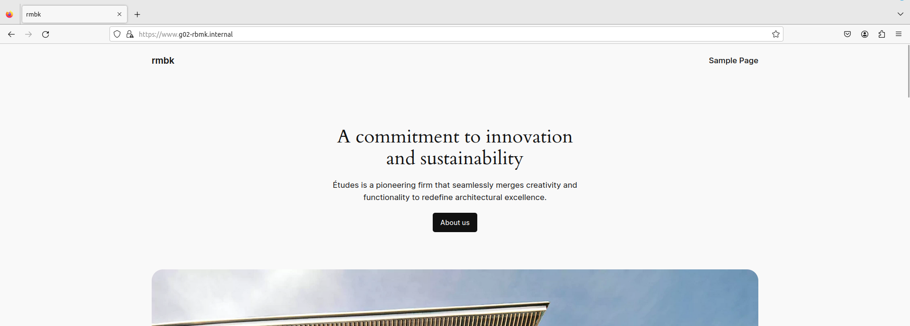

# Testplan

> [!WARNING]
> Meerdere zaken moeten 'up and running' zijn om dit te kunnen testen.

- Auteur(s) testplan: Xander Dheedene

## Eerste vereisten

- Er is een (virtuele) router nodig die kan routeren tussen vlan 11, 13, 42 en een verbinding kan maken met het internet. ([Instructies virutele router](./virtuele-router.md))
- Er is een werkende [DNS](../../../windows/winserv1/scripts/DNS/winserv1-dns-config.ps1) server op het ip van winserv1 (`192.168.102.130`).
- Er is een werkende client verbonden op vlan 11.
- Het is aanbevolen om een ppk-pair aan te maken op de client, en de public key in [common.sh](../../provisioning/common.sh) toe te voegen als variabele `pub_vr_client`. Zo kan je inloggen met ssh op de servers en extra testen uitvoeren.

## Installatie

### Run script (makkelijkst)

- Zorg ervoor dat `VBoxManage.exe` in uw `path` staat
- Open een terminal in de map `<docroot>/opdrachten/VMs/linux`
- Voer het script `Run.ps1` uit met volgende paramters: `Run.ps1 -test -db -web -proxy`

### Manueel

Aangezien er een TFTP-server in hetzelfde vagrant-up commando zit, doen we elke service appart. 

> [!CAUTION]
> Volgorde is van belang!
> 
> Vanaf 1 VM faalt stopt het testen.

#### Init install

- Zorg dat je in de juiste map (`<docroot>/opdrachten/VMs/linux/`) zit met een terminal venster
- Run `vagrant up db1`
- Run `vagrant up web1`
- Run `vagrant up proxy1`

#### Interfaces goed zetten

- Run `vagrant halt`, of stop alle 3 de VMs die net zijn aangemaakt in VirutaBbox Manager.
- Vink de 1ste netwerkadapter uit op die 3 VMs (dit zou de NAT adapter moeten zijn).
- Start ze opnieuw op (volgorde maakt van minder belang, maar wordt aanbevolen als: db1, web1, proxy1).

## Test: Laden website met HTTPS

Testprocedure:

1. Open een webbrowser op een client
2. Surf naar `https://g02-rbmk.internal`
3. Indien er een unsafe komt, accepteer het risico en ga verder naar de site
4. Controlleer of alles goed inlaad
5. Controlleer of je terug wordt gesturrd naar `https://www.g02-rbmk.internal`

Verwacht resultaat:

- De website wordt correct ingeladen 

## Test: Inloggen met HTTPS

Testprocedure:

1. Open een webbrowser naar keuze op een client
2. Surf naar `https://g02-rbmk.internal/wp-admin`
3. Log in met username `rbmk2324` en wachtwoord `rbmk2324`

Verwachte resultaat

- Je kan inloggen op de website 
- De homepagina van wp-admin wordt correct ingeladen 

## Test: HTTP/2

Testprocedure:

1. Open een webbrowser op een client
2. Open de dev tools (f12) en ga naar netwerk tab
3. Surf naar `https://g02-rbmk.internal`
4. Controlleer de response header

Verwachte resultaat

- De website gebruikt HTTP/2 

## Test: Enkel connectie met de proxy

Testprocedure:

1. Installeer op de client Wireshark
2. Begin met luisteren op de interface die verbonden is met het netwerk
3. Open een browser en surf naar `https://g02-rbmk.internal`
4. Surf wat rond op de website terwijl de Wireshark capture draait.
5. Controlleer dat je niet met `192.168.102.131` of `192.168.102.132` communiceert maar wel met `192.168.102.226` (DNS mag je hier negeren (`192.168.102.130`))

Verwachte resultaat

- Enkel de IPs `192.168.102.130` en `192.168.102.226` (van alle IP-adressen in ons netwerk) worden aangesproken 

## Test: Versie niet openbaar

Testprocedure:

1. Open een terminal op de client
2. Installeer nmap
3. Voer het volgende commando uit `nmap -sV -p 443 192.168.102.226` of `nmap -sV -p 443 g02-rbmk.internal`
4. Controlleer dat `VERSION` geen versie nummer heeft

Verwachte resultaat

- Nginx wordt getoont, maar geen versie nummer 
