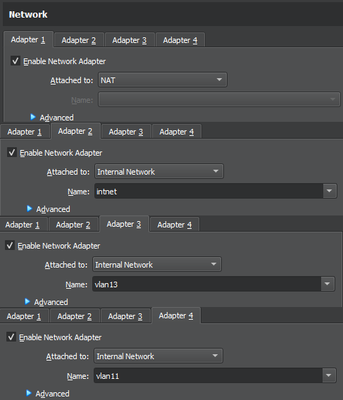

# Virtuele router

Voer het commando `vagrant up` uit in de map `<docroot>/opdrachten/Netwerken/virtual-router`.

Hierna stop je de VM met `vagrant halt` en pas je de netwerk instellingen aan zoals in onderstaande afbeeldingen (Voor de installatie met vagrant is het nodig om adapter 3 ook op intnet te plaatsen):

Hier speelt intnet als VLAN42.

Indien je werkt met een virtual router kan het handig zijn om een ppk-pair aan te maken op de router. Zo kan je vanuit de router inloggen op de rest van de servers. Hiervoor gebruik je `ssh-keygen`. Kopieer dan de public key in het [common provisioning script](../../provisioning/common.sh) onder de variabele pub_router.