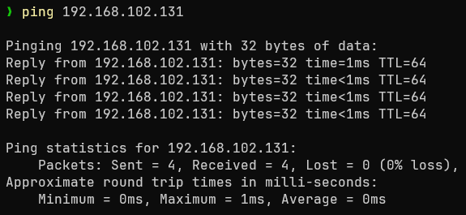
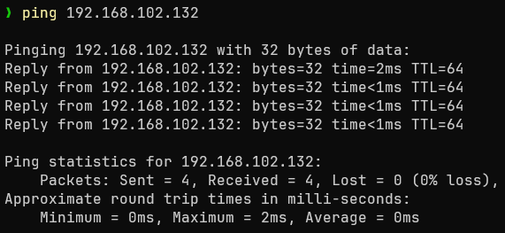
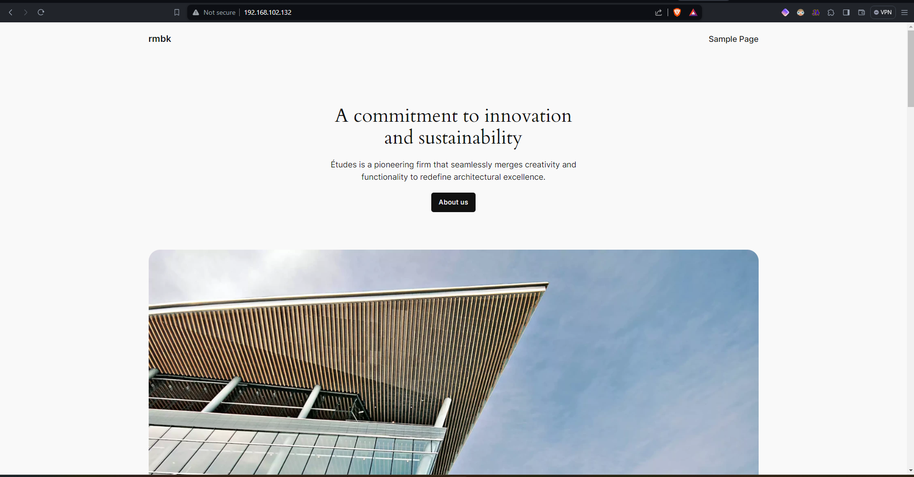
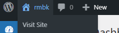
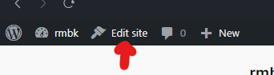
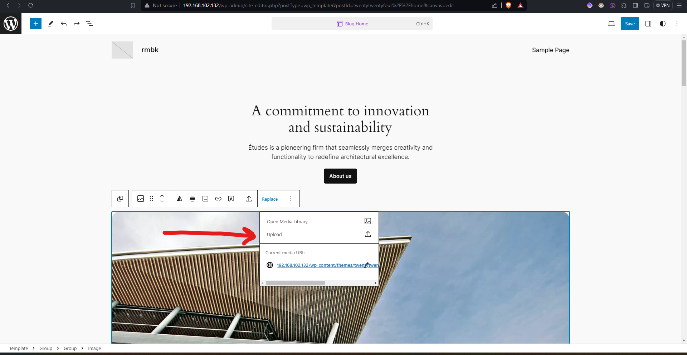
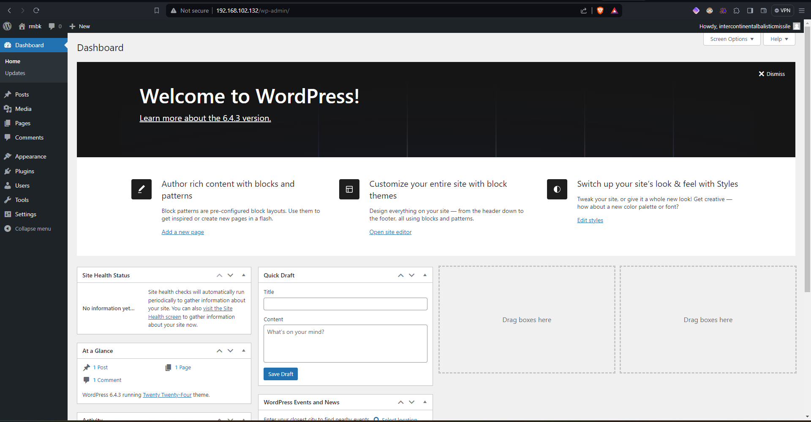
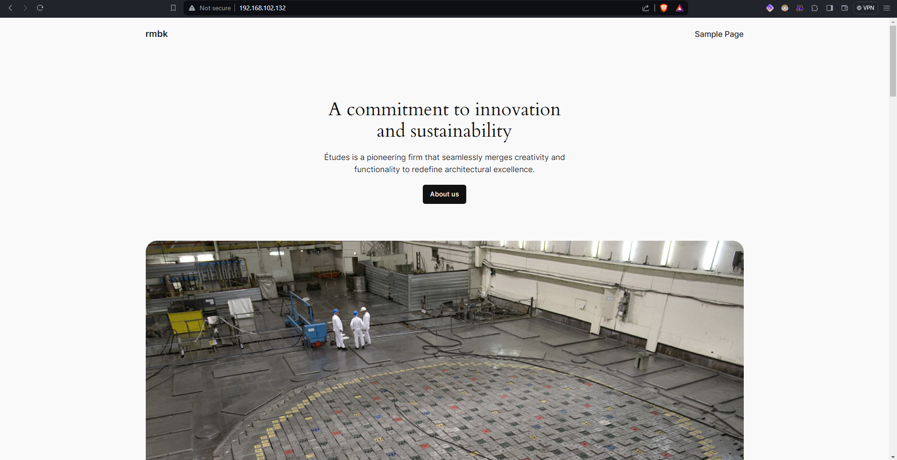

# Testplan

- Auteur(s) testplan: Xander Dheedene

## Test: Netwerkverbinding (hostonly)

Testprocedure:

1. Open een terminal venster in deze map.
2. Run `vagrant up`.
3. Ping van op de host naar `192.168.102.131` (Databank).
4. Ping van op de host naar `192.168.102.132` (Webserver).

Verwacht resultaat:

- De pings werken

## Test: Laden website

Testprocedure:

1. Open een browser naar keuze.
2. Surf naar `http://192.168.102.132`.

Verwacht resultaat:

- De standaard website wordt ingeladen

## Test: Aanpassen website

Testprocedure:

1. Open een browser naar keuze.
2. Surf naar `http://192.168.102.132/wp-admin`.
3. Log in met username: `rbmk2324` en password: `rbmk2324`
4. Klik linksboven naast het worpress logo op rbmk

5. Klik linksboven naast rbmk op `Edit site`

6. Selecteer een afbeelding en vervang deze met een eigen upload

7. Selecteer een afbeelding op jouw schijf.
8. Sla deze aanpassing op door rechtsboven op save te drukken.
9. Keer terug naar de homepagina (`http://192.168.102.132/`).

Verwacht resultaat:

- Na het heropenen van `http://192.168.102.132/` zou de afbeelding aangepast moeten zijn.
