# Testplan

> [!WARNING]
> Meerdere zaken moeten 'up and running' zijn om dit te kunnen testen.

- Auteur(s) testplan: Xander Dheedene

## Eerste vereisten

- Er is een (virtuele) router nodig die kan routeren tussen de netwerken en een verbinding kan maken met het internet. ([Instructies virutele router](../proxy/virtuele-router.md))
- Er is een werkende [Windows Server](../../../windows/winserv1/scripts/winserv1-init.ps1)
- Er is een werkende [Windows Client](../../../windows/winclient1/scripts/winclient1-init.ps1) (Deze zal eerst in intnet moeten zitten om de setup te laten werken. Zie [regel 12 in het post-install.ps1 script](../../../windows/winclient1/scripts/winclient1-post-install.ps1))
- Het is aanbevolen om een ppk-pair aan te maken op de client, en de public key in [common.sh](../../provisioning/common.sh) toe te voegen als variabele `pub_vr_client`. Zo kan je inloggen met ssh op de servers en extra testen uitvoeren.

### Nodige DNS records:

| Type | URL | Dest |
| ---- | --- | ---- |
| A | db1.g02-rbmk.internal | 192.168.102.131 |
| A | web-bas1.g02-rbmk.internal | 192.168.102.132 |
| A | web-ext1.g02-rbmk.internal | 192.168.102.132 |
| A | web-ext2.g02-rbmk.internal | 192.168.102.134 |
| A | nc1.g02-rbmk.internal | 192.168.102.134 |
| A | proxy1.g02-rbmk.internal | 192.168.102.226 |
| | | |
| AAAA | db1.g02-rbmk.internal | fd69:6f00:73d8:2c42::3 |
| AAAA | web-bas1.g02-rbmk.internal | fd69:6f00:73d8:2c42::4 |
| AAAA | web-ext1.g02-rbmk.internal | fd69:6f00:73d8:2c42::4 |
| AAAA | web-ext2.g02-rbmk.internal | fd69:6f00:73d8:2c42::6 |
| AAAA | nc1.g02-rbmk.internal | fd69:6f00:73d8:2c42::6 |
| AAAA | proxy1.g02-rbmk.internal | fd69:6f00:73d8:2c13::2 |
| | | |
| CNAME | www.g02-rbmk.internal | proxy1.g02-rbmk.internal |
| CNAME | g02-rbmk.internal | proxy1.g02-rbmk.internal |
| CNAME | nextcloud.g02-rbmk.internal | proxy1.g02-rbmk.internal |
| CNAME | ext.g02-rbmk.internal | proxy1.g02-rbmk.internal |

## Installatie

### Run script (aanbevolen)

- Zorg ervoor dat `VBoxManage.exe` in uw `path` staat
- Open een terminal in de map `<docroot>/opdrachten/VMs/linux`
- Voer het script `Run.ps1` uit met volgende paramters: `Run.ps1 -test -db -web -proxy -nc`
- Ga naar de netwerk instellingen van de proxy VM en vervang `intnet` naar `vlan13` als ook netwerk adapter 3 van de virtuele router
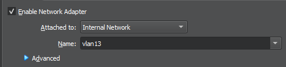

### Manueel

Aangezien er een TFTP-server in hetzelfde vagrant-up commando zit, doen we elke service appart. 

> [!CAUTION]
> Elke VM is nodig. 
> Vanaf 1 VM faalt stopt het testen.

#### Init install

*(Voor de installatie sneller te maken, kan je de run commandos elk in hun eigen terminal runnen.)*

- Zorg dat je in de juiste map (`<docroot>/opdrachten/VMs/linux/`) zit met een terminal venster
- Run `vagrant up db1`
- Run `vagrant up web1`
- Run `vagrant up nextcloud`
- Run `vagrant up proxy1`

#### Interfaces goed zetten

- Run `vagrant halt`, of stop alle 3 de VMs die net zijn aangemaakt in VirutaBbox Manager.
- Vink de 1ste netwerkadapter uit op die 3 VMs (dit zou de NAT adapter moeten zijn).
- Verander ook de naam van `intnet` naar `vlan13` op de proxy VM

- Start ze opnieuw op (volgorde maakt van minder belang, maar wordt aanbevolen als: db1, web1, nextcloud, proxy1).

## Test: Laden basis website met HTTPS

Testprocedure:

1. Open een webbrowser op een client
2. Surf naar `https://g02-rbmk.internal`
3. Indien er een unsafe komt, accepteer het risico en ga verder naar de site
4. Controlleer of alles goed inlaad
5. Controlleer of je terug wordt gesturrd naar `https://www.g02-rbmk.internal`

Verwacht resultaat:

- De basis website wordt correct ingeladen 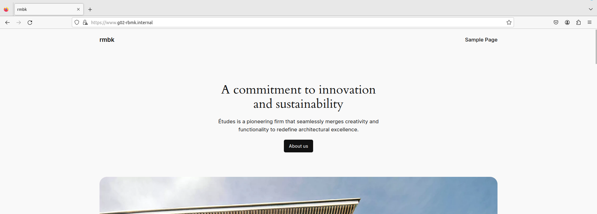

## Test: Inloggen met HTTPS

Testprocedure:

1. Open een webbrowser naar keuze op een client
2. Surf naar `https://g02-rbmk.internal/wp-admin`
3. Log in met username `rbmk2324` en wachtwoord `rbmk2324`

Verwachte resultaat

- Je kan inloggen op de website 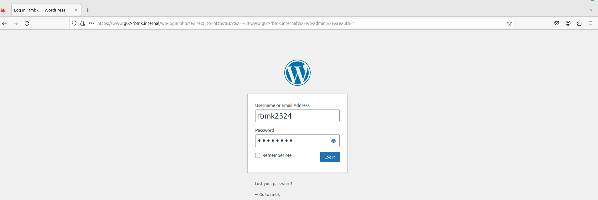
- De homepagina van wp-admin wordt correct ingeladen 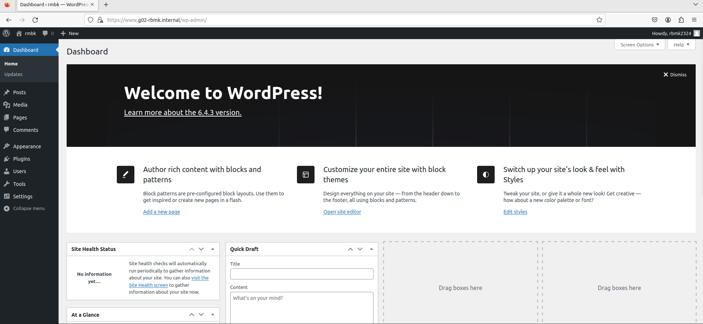

## Test: HTTP/2

Testprocedure:

1. Open Firefox op een client
2. Open de dev tools (f12) en ga naar netwerk tab
3. Surf naar `https://g02-rbmk.internal`
4. Controlleer de response header

Verwachte resultaat

- De website gebruikt HTTP/2 

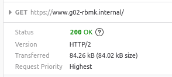

## Test: Nextcloud

Testprocedure:

1. Open een webbrowser op een client
2. Surf naar `https://nextcloud.g02-rbmk.internal`
3. Log in met username `rbmk2324` en wachtwoord `rbmk2324`
4. Indien er een `Temporary Error` is, log opnieuw in met dezelfde gegevens
5. Upload een bestand.

Verwacht resultaat:

- Het bestand wordt geupload zonder problemen

## Test: Enkel connectie met de proxy

Testprocedure:

1. Installeer op de client Wireshark
2. Begin met luisteren op de interface die verbonden is met het netwerk
3. Open een browser en surf naar `https://g02-rbmk.internal`
4. Surf wat rond op de website terwijl de Wireshark capture draait.
5. Controlleer dat je enkel met de proxy communiceert (`192.168.102.226`, `fd69:6f00:73d8:2c13::2`) (DNS mag je hier negeren (`192.168.102.130`, `192.168.102.130`, `fd69:6f00:73d8:2c42::2` of `fd69:6f00:73d8:2c42::8`))

Verwachte resultaat

- Enkel de IPs `192.168.102.130` en `192.168.102.226` (van alle IP-adressen in ons netwerk) worden aangesproken 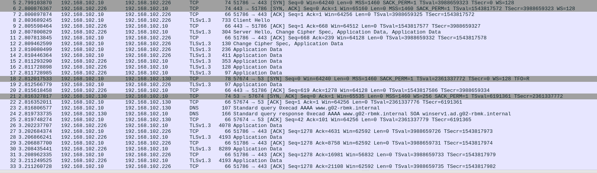

## Test: Proxy versie niet openbaar

Testprocedure:

1. Open een terminal op de client
2. Installeer nmap
3. Voer het volgende commando uit `nmap -sV -p 443 192.168.102.226` of `nmap -sV -p 443 g02-rbmk.internal`
4. Controlleer dat `VERSION` geen versie nummer heeft

Verwachte resultaat

- Nginx wordt getoont, maar geen versie nummer 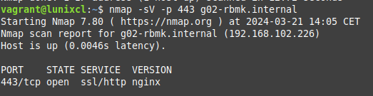

## Test: Extra webserver + loadbalanced

Testprocedure:

1. Log in op de proxy
2. Installeer tcpdump: `sudo dnf install -y tcpdump`
3. Run `sudo tcpdump -n -w /vagrant/testplan/testplan_v2-web_ext_prox_nc.pcap`
4. Open een webbrowser op een client
5. Surf naar `https://ext.g02-rbmk.internal`
6. Controlleer of de website goed inlaad
7. Herlaad de pagina (f5) meerdere keren (5-10x)
8. Stop de tcpdump op de proxy met `ctrl + C`
9. Open het pcap bestand dat in deze map staat met WireShark
10. Controleer of er enkel communicatie is met 1 enkele achterliggende server
11. Haal die server offline, en controleer of je nog steeds naar de website kan surfen

Verwachte resultaat:

- Initieel verbind je met of web-ext1 of met web-ext2
- Na het offline halen en refreshen (zonder cache), krijg je opnieuw de pagina te zien (verbonden door de andere server)

## Test: Nextcloud app - bestand uploaden

Testprocedure:

1. Op de windows client, download de nextcloud app van [nextcloud.com/install](https://nextcloud.com/install/) of [via de directe link](https://github.com/nextcloud-releases/desktop/releases/latest/download/Nextcloud-3.13.0-x64.msi)
2. Doorloop de installatie wizzard (standaard instellingen zijn oke)
3. Herstart het systeem zoals gevraagd (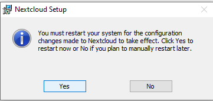)
4. Start de nextcloud app, en geef de de url `nextcloud.g02-rbmk.internal` in
5. Accepteer de security warning door te klikken op log in: 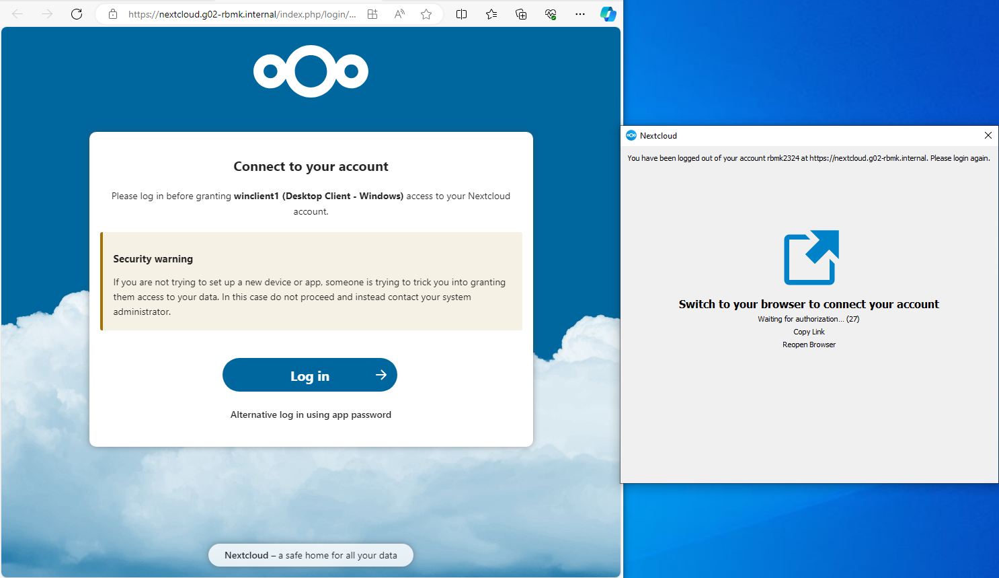
6. Log in met username `rbmk2324` en password `rbmk2324`
7. Klik op grant access 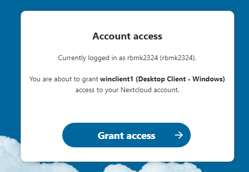
8. Open file explorer en ga naar `C:\Users\Administrator\Nextcloud` ()
9. Maak een nieuw bestand aan / plaats een bestand in die map
10. Surf naar `https://nextcloud.g02-rbmk.internal` en log in. Controlleer of het bestand zichtbaar is onder files

Verwachte resultaat:

- Voor het aanmaken bestand in explorer: 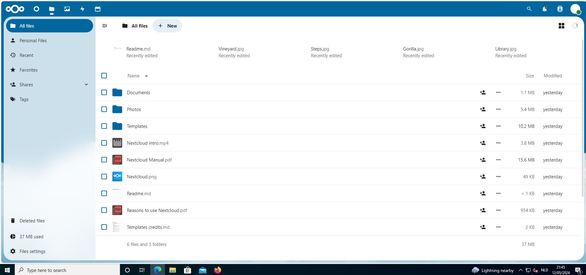
- Aanmaken van een bestand 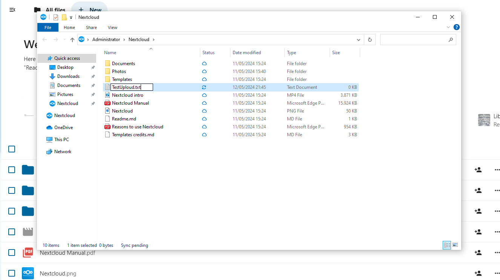
- Data toevoegen in het bestand 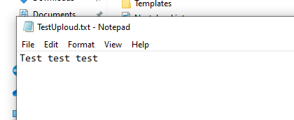
- Na het aanmaken van het bestand: 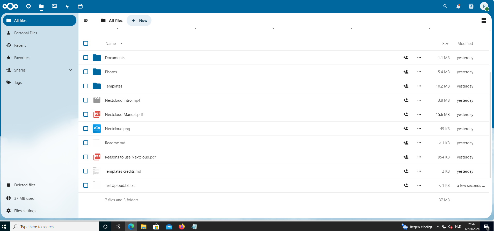
- Controle inhoud 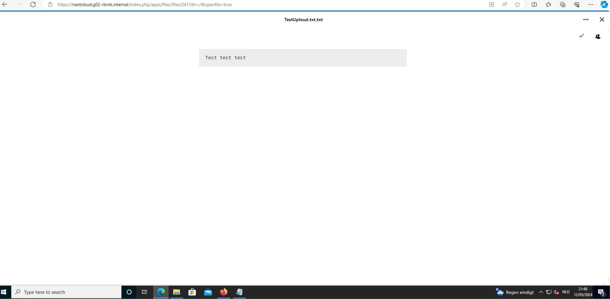

## Test: Nextcloud calendar - Thunderbird sync

Testprocedure:

1. Open de calendar app op `https://nextcloud.g02-rbmk.internal`
2. Op de windows client, download en installeer [thunderbird](https://www.thunderbird.net/en-US/) (standaard instellingen voor installatie zijn goed)
3. Ga naar de instellingen op thunderbird en ga naar "Add-ons en thema's" 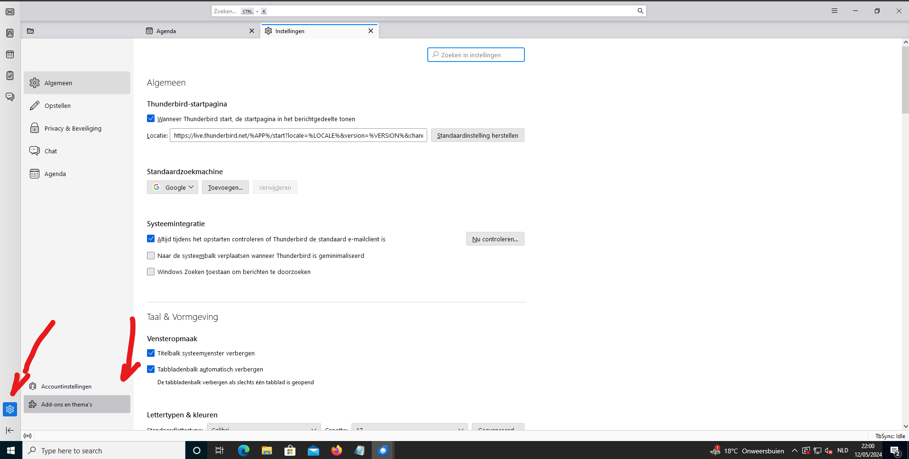
4. Installeer zowel [TBSync](https://addons.thunderbird.net/en/thunderbird/addon/tbsync/) als [TBSync provider for CalDAV and CardDAV](https://addons.thunderbird.net/en-GB/thunderbird/addon/dav-4-tbsync/)
5. Bij extentiebeheer, selecteer het sleutel icoon van TBSync -> "account actions" -> "add new account" -> "CalDAV" 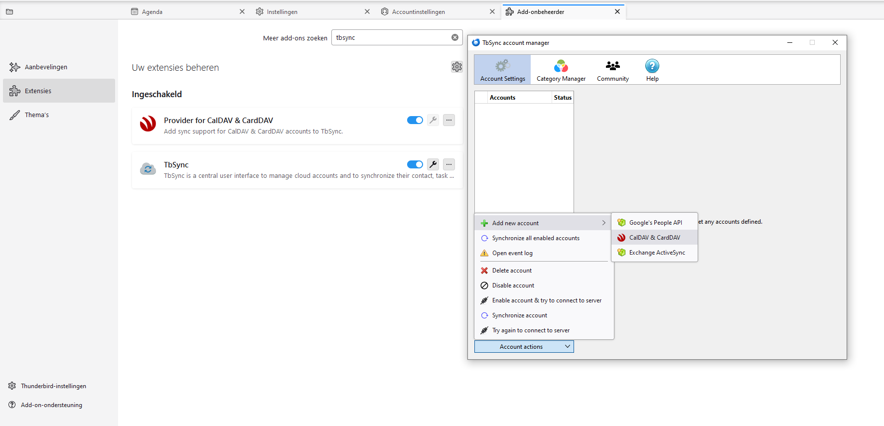
6. Kies voor automatische configuratie 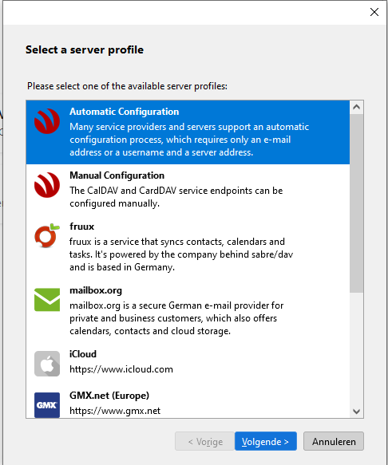
7. Account gegevens (volgende + finish) 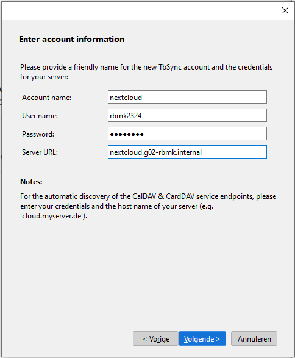
8. Enable syncronisatie 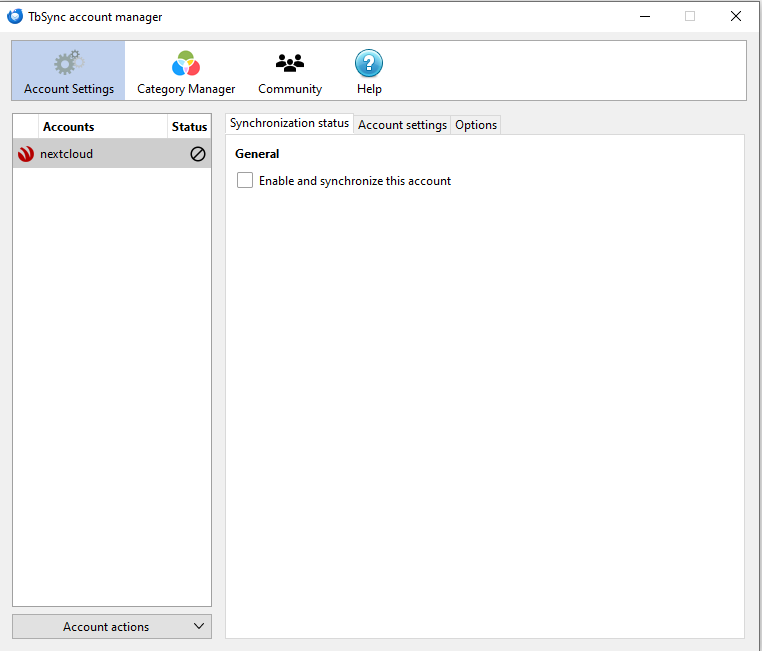
9. Selecteer alle beschikbare bronnen, en syncrosineer 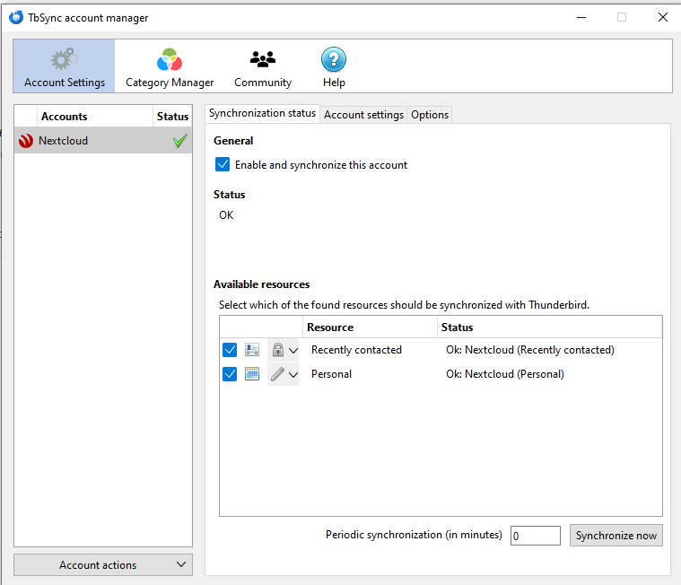
10. Ga naar het tablad van de agenda's in thunderbird en maak een nieuw event aan op de agenda van nextcloud
11. Herlaad de nextcloud website, het aangemaakte event zou zich in de agenda moeten bevinden

Verwachte resultaat:

- Event is aangemaakt in thunderbird 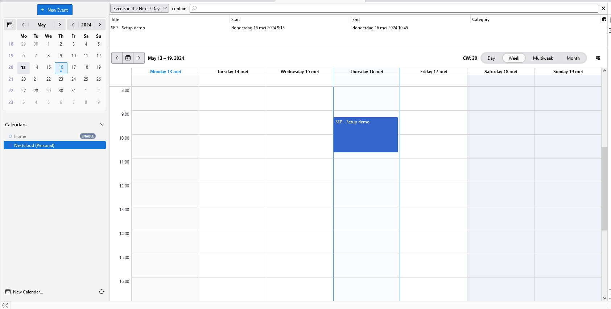
- Event is ook zichtbaar in nextcloud web 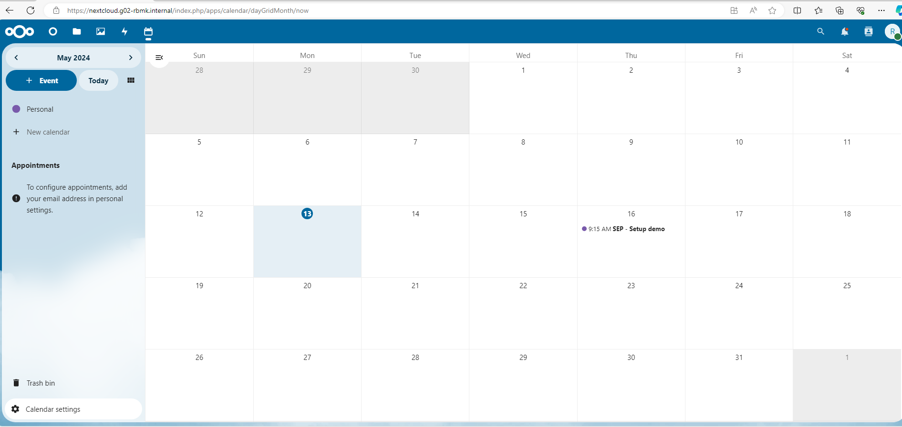