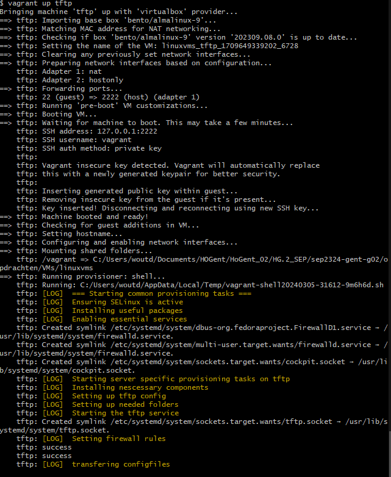
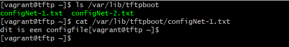

# Testplan

- Auteur(s) testplan: Wout De Temmerman

## Test: Netwerkverbinding VM testen

Testprocedure:

1. Voer in git bash terminal `vagrant up tftp` uit
2. Wacht tot volledige installatie is voltooid
3. `ping 192.168.102.195`

Verwacht resultaat:

- VM start op zonder error's te geven
- De VM is raadpleegbaar via ingesteld ip addres

## Test: Inhoud controleren van TFTP files voor config Routers en Switches

Testprocedure:

1. Verbind via `vagrant ssh tftp` naar de VM
2. Controleer of de 2 configFiles in de map `/var/lib/tftpboot` zitten

Verwacht resultaat:

- Er zijn 2 files zichtbaar die de configuratie van de Switch en Router bevatten

