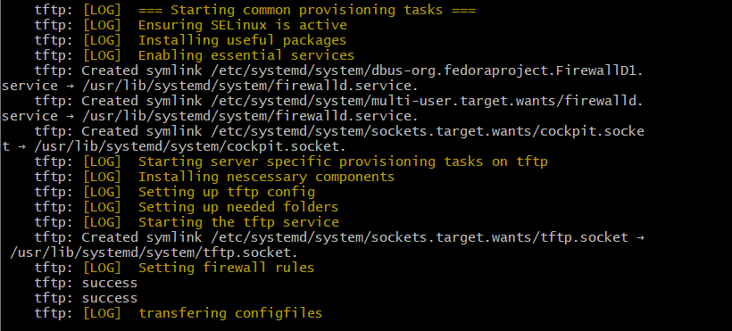
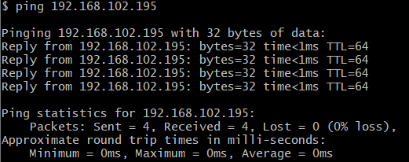
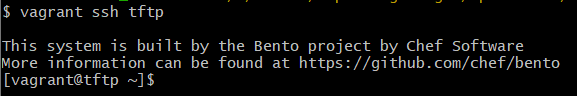
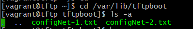
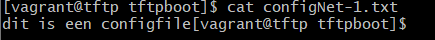
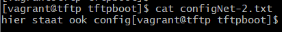

# Testrapport

- Uitvoerder(s) test: Maarten Adriaenssens
- Uitgevoerd op: 11/03/2024
- Github commit: a354bd8

## Test: Netwerkverbinding VM testen

Testprocedure:

1. Voer in git bash terminal `vagrant up tftp` uit
2. Wacht tot volledige installatie is voltooid
3. `ping 192.168.102.195`

Verkregen resultaat:

- Voltooide installatie, geen errors
- Ping ok

<!-- Voeg hier eventueel een screenshot van het verkregen resultaat in. -->

Test geslaagd:

- [x] Ja
- [ ] Nee

Opmerkingen:

- ...

## Test: Inhoud controleren van TFTP files voor config Routers en Switches

Testprocedure:

1. Verbind via `vagrant ssh tftp` naar de VM

2. Controleer of de 2 configFiles in de map `/var/lib/tftpboot` zitten

Verkregen resultaat:

- Verbinding ok
- check via `ls -a`
- check via `cat`

<!-- Voeg hier eventueel een screenshot van het verkregen resultaat in. -->

Test geslaagd:

- [x] Ja
- [ ] Nee

Opmerkingen:

- 

## Test: <!-- Omschrijving test. -->

...
