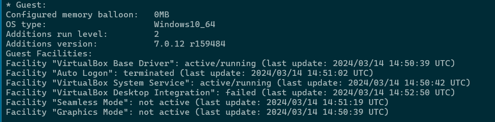

# Testrapport

- Uitvoerder(s) test: Maarten Adriaenssens
- Uitgevoerd op: 14/03/2024
- Github commit: 417c46

## Test: Wordt de winclient1 VM correct geïnstalleerd?

Test procedure:

1. Open een nieuw PowerShell-venster en open VirtualBox.
2. Verander de working directory in PowerShell naar `sep2324-gent-g02\opdracht\VMs\windows\winclient1\scripts`.
3. Voer `.\winclient1-init.ps1` uit in het PowerShell venster.
4. Er wordt gevraagd om _pathToIsoFile_ te definiëren. Geef het pad in van de Windows 10 installatieschijf. Dit bestand dien je zelf te downloaden vanaf Academic Software.
5. Optioneel: als je het script al eerder uitvoerde, dien je aan te geven dat je de reeds bestaande VM wenst te overschrijven.

Verkregen resultaat:

- Installatie compleet

<!-- Voeg hier eventueel een screenshot van het verkregen resultaat in. -->


Test geslaagd:

- [x] Ja
- [ ] Nee

Opmerkingen:

- Geen

## Test: Zijn de VirtualBox Guest Additions automatisch geïnstalleerd?

Testprocedure:

1. Open een nieuw PowerShell venster op de host.
2. Voeg het VirtualBox pad toe aan de padvariabele door volgend commando uit te voeren:

   ```powershell
   $env:PATH = $env:PATH + ";C:\Program Files\Oracle\VirtualBox"
   ```

3. Voer het volgende commando uit om de details van de _winclient1_ VM op te vragen.

   ```powershell
   VBoxManage.exe showvminfo winclient1
   ```

Verkregen resultaat:

- Toont correcte info

<!-- Voeg hier eventueel een screenshot van het verkregen resultaat in. -->



Test geslaagd:

- [x] Ja
- [ ] Nee

Opmerkingen:

- Geen
