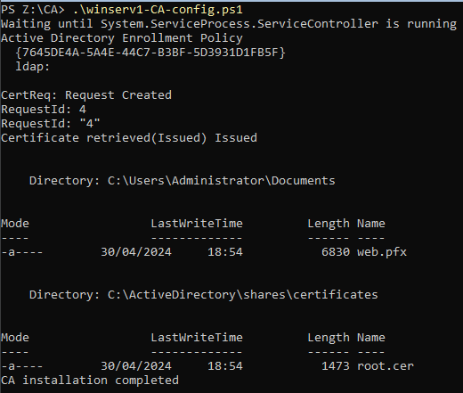
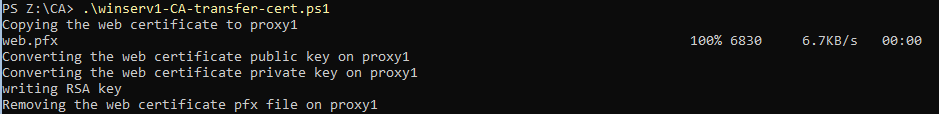
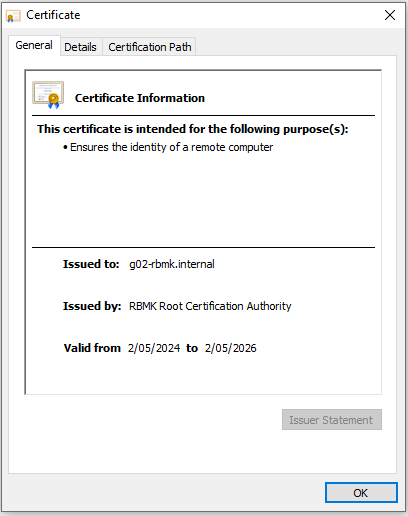

# Testplan

- Auteur testplan: Neal Joos

## Test: Wordt het script correct geïnstalleerd?

Testprocedure:

1. Open een PowerShell-venster op _winserv1_.
2. Verander de working directory in PowerShell naar `Z:\CA`.
3. Voer `.\winserv1-CA-config.ps1` uit.

Verwacht resultaat:

- De uitvoer van het script dient gelijkaardig te zijn aan de onderstaande uitvoer.

  

## Test: Worden de scripts correct overgezet naar de reverse proxy?

Testprocedure:

1. Zorg dat _proxy1_ draait (zie testplan _proxy1_).
2. Open een PowerShell-venster op _winserv1_.
3. Verander de working directory in PowerShell naar `Z:\CA`.
4. Voer `.\winserv1-CA-transfer-cert.ps1` uit.

Verwacht resultaat:

- De uitvoer van het script dient gelijkaardig te zijn aan de onderstaande uitvoer.

  

## Test: Is het certificaat vertrouwd op de clients?

Testprocedure:

1. Start _winclient1_ volgens het testplan.
2. Open een browservenster en ga naar [https://g02-rbmk.internal](https://g02-rbmk.internal)
3. Bekijk de certificaatdetails, dit dient overeen te komen met de onderstaande uitvoer.

Verwacht resultaat:

- De uitvoer van het script dient gelijkaardig te zijn aan de onderstaande uitvoer.

  
