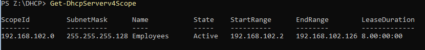

# Testplan

- Auteur testplan: Neal Joos

## Test: Wordt het script correct geïnstalleerd?

Testprocedure:

1. Open een PowerShell-venster binnen _winserv1_.
2. Verander de working directory in PowerShell naar `Z:\DHCP`.
3. Voer `.\winserv1-dhcp-install.ps1` uit.

Verwacht resultaat:

- De uitvoer van het script dient gelijkaardig te zijn aan de onderstaande uitvoer.

  

## Test: Wordt de DHCP-server gekoppeld aan de juiste interface?

Testprocedure:

1. Voer `Get-DhcpServerv4Binding` uit.

Verwacht resultaat:

- De uitvoer van het script dient gelijkaardig te zijn aan de onderstaande uitvoer.

  

## Test: Wordt de DHCP-scope aangemaakt zoals het moet?

Testprocedure:

1. Voer `Get-DhcpServerv4Scope` uit.

Verwacht resultaat:

- De uitvoer van het script dient gelijkaardig te zijn aan de onderstaande uitvoer.

  
