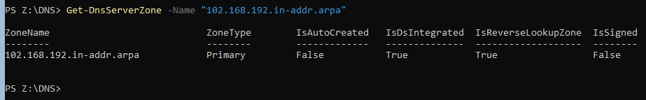

# Testplan

- Auteurs testplan: Tariq Asifi

## Test: Is het DNS-installatiescript succesvol uitgevoerd?

Testprocedure:

1. Open een nieuw PowerShell-venster
2. Verander de working directory in PowerShell naar `sep2324-gent-g02\opdracht\VMs\windows\winserv1\scripts\DNS`.
3. Voer `.\winserv1-dns-config.ps1` uit in het PowerShell venster.

Verwacht resultaat:

- Script voltooid zonder foutmeldingen en de laatste lijn geeft weer dat de dnsServer werkt.

  ```powershell
  PS                                                                                                                  PS C:\Users\Administrator> # Installatie DNS op SEP_Server                                                              PS C:\Users\Administrator> Install-WindowsFeature -Name DNS -IncludeManagementTools                                                                                                                                                             Success Restart Needed Exit Code      Feature Result
  ------- -------------- ---------      --------------
  True    No             NoChangeNeeded {}


  PS C:\Users\Administrator>
  PS C:\Users\Administrator>
  PS C:\Users\Administrator> # Parameters
  PS C:\Users\Administrator> $DnsForwarderAddresses = "8.8.8.8", "8.8.4.4"
  PS C:\Users\Administrator> $InterfaceAlias = "Ethernet"
  PS C:\Users\Administrator> $DnsServerAddress = "192.168.102.130"
  PS C:\Users\Administrator> $NetworkID= "192.168.102.0/27"
  PS C:\Users\Administrator> $zoneName = (Get-WmiObject Win32_ComputerSystem).Domain      #ad.g02-rbmk.internal
  PS C:\Users\Administrator> $ZoneName2 = $ZoneName.Replace("ad.", "") #g02-rbmk.internal
  PS C:\Users\Administrator> $ReverseZoneName = "0.102.168.192.in-addr.arpa"
  PS C:\Users\Administrator>
  PS C:\Users\Administrator>
  PS C:\Users\Administrator> # Configure DNS forwarder
  PS C:\Users\Administrator> Set-DnsServerForwarder -IPAddress $DnsForwarderAddresses
  PS C:\Users\Administrator>
  PS C:\Users\Administrator> # Configureer DNS om alleen te luisteren naar het interne netwerk (bijv. LAN-interface)
  PS C:\Users\Administrator> Set-DnsClientServerAddress -InterfaceAlias $InterfaceAlias -ServerAddresses @($DnsServerAddress)
  PS C:\Users\Administrator>
  PS C:\Users\Administrator>
  PS C:\Users\Administrator>
  PS C:\Users\Administrator> # Check als the zone bestaat
  PS C:\Users\Administrator> if (Get-DnsServerZone -Name $ZoneName -ErrorAction SilentlyContinue) {
  >>     # Zone bestaat, channge
  >>     Set-DnsServerPrimaryZone -Name $ZoneName -DynamicUpdate Secure
  >>     Write-Host "Zone '$ZoneName' bestaat al. verander de bestande zone."
  >> } else {
  >>
  >> Add-DnsServerPrimaryZone -Name $ZoneName -ReplicationScope Forest -DynamicUpdate Secure
  >>     Write-Host "Zone '$ZoneName' bestaat niet. maak een nieuwe zone."
  >> }
  Zone 'ad.g02-rbmk.internal' bestaat al. verander de bestande zone.
  PS C:\Users\Administrator>
  PS C:\Users\Administrator> # Check als de zone bestaat
  PS C:\Users\Administrator> if (Get-DnsServerZone -Name $ZoneName2 -ErrorAction SilentlyContinue) {
  >>     # Zone bestaat, wijziging
  >>     Set-DnsServerPrimaryZone -Name $ZoneName2 -DynamicUpdate Secure
  >>     Write-Host "Zone '$ZoneName2' bestaat al. Wijzig de bestaande zone."
  >> } else {
  >>     # Zone bestaat niet, maak een nieuwe zone
  >>     Add-DnsServerPrimaryZone -Name $ZoneName2 -ReplicationScope Forest -DynamicUpdate Secure
  >>     Write-Host "Zone '$ZoneName2' bestaat niet. Maak een nieuwe zone."
  >> }
  Zone 'g02-rbmk.internal' bestaat niet. Maak een nieuwe zone.
  PS C:\Users\Administrator>
  PS C:\Users\Administrator>
  PS C:\Users\Administrator> #voeg dns revers lookup zone
  PS C:\Users\Administrator> Add-DnsServerPrimaryZone -NetworkId $NetworkID -ReplicationScope Forest
  PS C:\Users\Administrator>
  PS C:\Users\Administrator>
  PS C:\Users\Administrator>
  PS C:\Users\Administrator> # Aanmaken van A-records
    PS C:\Users\Administrator> Add-DnsServerResourceRecordA -Name "db1" -ZoneName "g02-rbmk.internal" -IPv4Address "192.168.102.131"                                                                                                                PS C:\Users\Administrator> Add-DnsServerResourceRecordA -Name "web-bas1" -ZoneName $ZoneName2 -IPv4Address "192.168.102.132"                                                                                                                    PS C:\Users\Administrator> Add-DnsServerResourceRecordA -Name "web-ext1" -ZoneName $ZoneName2 -IPv4Address "192.168.102.133"                                                                                                                    PS C:\Users\Administrator> Add-DnsServerResourceRecordA -Name "nc1" -ZoneName $ZoneName2 -IPv4Address "192.168.102.134" PS C:\Users\Administrator> Add-DnsServerResourceRecordA -Name "matrix1" -ZoneName $ZoneName2 -IPv4Address "192.168.102.135"                                                                                                                     PS C:\Users\Administrator> Add-DnsServerResourceRecordA -Name "proxy1" -ZoneName $ZoneName2 -IPv4Address "192.168.102.226"                                                                                                                      PS C:\Users\Administrator> Add-DnsServerResourceRecordA -Name "tftp" -ZoneName $ZoneName2 -IPv4Address "192.168.102.195"                                                                                                                        PS C:\Users\Administrator>                                                                                              PS C:\Users\Administrator> # Aanmaken van PTR-records                                                                   PS C:\Users\Administrator> Add-DnsServerResourceRecordPtr -Name "131" -ZoneName $ReverseZoneName -PtrDomainName "db1.g02-rbmk.internal"                                                                                                         PS C:\Users\Administrator> Add-DnsServerResourceRecordPtr -Name "132" -ZoneName $ReverseZoneName -PtrDomainName "web-bas1.g02-rbmk.internal"
  PS C:\Users\Administrator> Add-DnsServerResourceRecordPtr -Name "133" -ZoneName $ReverseZoneName -PtrDomainName "web-ext1.g02-rbmk.internal"
  PS C:\Users\Administrator> Add-DnsServerResourceRecordPtr -Name "134" -ZoneName $ReverseZoneName -PtrDomainName "nc1.g02-rbmk.internal"
  PS C:\Users\Administrator> Add-DnsServerResourceRecordPtr -Name "135" -ZoneName $ReverseZoneName -PtrDomainName "matrix1.g02-rbmk.internal"
  PS C:\Users\Administrator> Add-DnsServerResourceRecordPtr -Name "226" -ZoneName $ReverseZoneName -PtrDomainName "proxy1.g02-rbmk.internal"
  PS C:\Users\Administrator> Add-DnsServerResourceRecordPtr -Name "195" -ZoneName $ReverseZoneName -PtrDomainName "tftp.g02-rbmk.internal"
  PS C:\Users\Administrator>
  PS C:\Users\Administrator> # Aanmaken van CNAME-records
  PS C:\Users\Administrator>
  PS C:\Users\Administrator> Add-DnsServerResourceRecordCName -Name "www" -HostNameAlias "web-bas1" -ZoneName "g02-rbmk.internal"
  PS C:\Users\Administrator>
  PS C:\Users\Administrator>
  PS C:\Users\Administrator>
  PS C:\Users\Administrator>
  PS C:\Users\Administrator> # Herstart de DNS-server om de wijzigingen toe te passen
  PS C:\Users\Administrator> Restart-Service DNS
  PS C:\Users\Administrator>
  PS C:\Users\Administrator> # Test internetconnectiviteit
  PS C:\Users\Administrator> Test-NetConnection -ComputerName "www.google.com" -Port 80


  ComputerName     : www.google.com
  RemoteAddress    : 108.177.15.104
  RemotePort       : 80
  InterfaceAlias   : Ethernet
  SourceAddress    : 10.0.2.15
  TcpTestSucceeded : True

  PS C:\Users\Administrator>

  ```

- Er is geen interactie van de gebruiker nodig en dient alles automatisch te verlopen.
- Tijdens of na de uitvoering van het script moet de DNS-service automatisch één keer opnieuw opstarten.

<!-- Voeg hier eventueel een screenshot van het verwachte resultaat in. -->

## Test: Correcte installatie van DNS-forward-lookup?

Testprocedure:

1. Open een PowerShell-venster op de Windows-server waarop de DNS-service wordt geïnstalleerd.

2. Voer het volgende commando uit om forward lookup zone te controleren.

   ```powershell
   Get-DnsServerZone -Name ad.g02-rbmk.internal,g02-rbmk.internal
   ```

Verwacht resultaat:

- De output dient gelijkaardig te zijn aan onderstaande output.
  
  ```powershell
   PS C:\Users\Administrator> Get-DnsServerZone -Name ad.g02-rbmk.internal,g02-rbmk.internal

  ZoneName                            ZoneType        IsAutoCreated   IsDsIntegrated  IsReverseLookupZone  IsSigned
  --------                            --------        -------------   --------------  -------------------  --------
  ad.g02-rbmk.internal                Primary         False           True            False                False
  g02-rbmk.internal                   Primary         False           True            False                False
  ```

<!-- Voeg hier eventueel een screenshot van het verwachte resultaat in. -->
  


## Test: Correcte  resolving DNS names to IP addresses?

Testprocedure:

1. Open een PowerShell-venster op de Windows-server waarop de DNS-service wordt geïnstalleerd.

2. Voer het volgende commando uit om forward lookup zone te controleren.

    ```powershell
   Resolve-DnsName www.g02.rbmk.internal 
    ```

Verwacht resultaat:

- De output dient gelijkaardig te zijn aan onderstaande output.
  
  

<!-- Voeg hier eventueel een screenshot van het verwachte resultaat in. -->
  


## Test: Correcte installatie van DNS-reverse-lookup?

Testprocedure:

  1. Open een PowerShell-venster op de Windows-server waarop de DNS-service wordt geïnstalleerd.

  2. Voer het volgende commando uit om forward lookup zone te controleren.

   ```powershell
   Get-DnsServerZone -Name "102.168.192.in-addr.arpa"
   ```

Verwacht resultaat:

- De output dient gelijkaardig te zijn aan onderstaande output.

  
  <!-- Voeg hier eventueel een screenshot van het verwachte resultaat in. -->


## Test: Controleer de DNS-clientconfiguratie

Testprocedure:

  1. Open een PowerShell-venster op de Windows-server waarop de DNS-service wordt geïnstalleerd.

  2. Voer het volgende commando uit om de DNS-clientconfiguratie te controleren.

   ```powershell
    Get-DnsClientServerAddress -InterfaceAlias "Ethernet"

   ```

Verwacht resultaat:

- De output dient gelijkaardig te zijn aan onderstaande output.

  ```powershell
   PS C:\Users\Administrator>  Get-DnsClientServerAddress -InterfaceAlias "Ethernet"

    InterfaceAlias               Interface Address ServerAddresses
                             Index     Family
    --------------               --------- ------- ---------------
    Ethernet                             6 IPv4    {192.168.102.130}
    Ethernet                             6 IPv6    {::1}

  ```
  

## Test: Controleer de DNS-forwarders na configuratie

Testprocedure:

  1. Open een PowerShell-venster op de Windows-server waarop de DNS-service wordt geïnstalleerd.

  2. Voer het volgende commando uit om de geconfisgureerde DNS-forwarders te controleren.

   ```powershell
   Get-DnsServerForwarder
   ```

Verwacht resultaat:

- De output dient gelijkaardig te zijn aan onderstaande output.

  ```powershell
   PS C:\Users\Administrator> Get-DnsServerForwarder
    UseRootHint        : True
    Timeout(s)         : 3
    EnableReordering   : True
    IPAddress          : {8.8.8.8, 8.8.4.4}
    ReorderedIPAddress : {8.8.8.8, 8.8.4.4}
  ```
  
## Test: Controleer  alle records in een zone na configuratie

Testprocedure:

  1. Open een PowerShell-venster op de Windows-server waarop de DNS-service wordt geïnstalleerd.

  2. Voer het volgende commando uit om de geconfigureerde records te controleren.

   ```powershell
   Get-DnsServerResourceRecord -ZoneName ad.g02-rbmk.internal
   Get-DnsServerResourceRecord -ZoneName g02-rbmk.internal
   ```

Verwacht resultaat:

- De output dient gelijkaardig te zijn aan onderstaande output.
  


## Test: Controleer de DNS-zones na herstart van de DNS-server

1. Open een PowerShell-venster op de SEP_Server.
2. Voer het volgende commando uit om de geconfigureerde DNS-zones te controleren:

```powershell
    Get-DnsServerZone
```

Verwacht resultaat:

- Alle geconfigureerde DNS-zones, inclusief forward-lookup en reverse-lookup, moeten correct worden weergegeven
  
