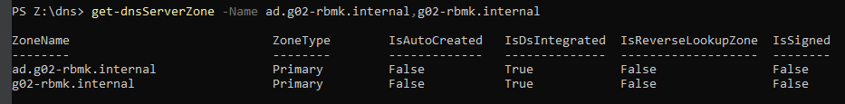
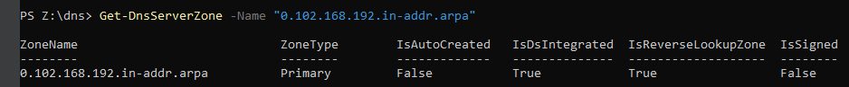
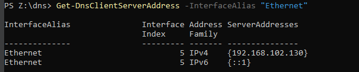
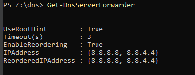
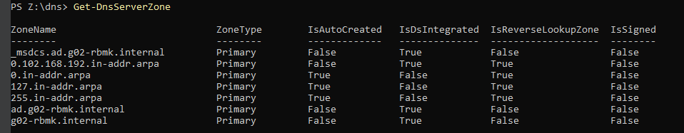

# Testrapport

- Uitvoerder(s) test: Maarten Adriaenssens
- Uitgevoerd op: 14/03/2024
- Github commit: 286ea7

## Test: Is het DNS-installatiescript succesvol uitgevoerd?

Testprocedure:

1. Open een nieuw PowerShell-venster
2. Verander de working directory in PowerShell naar `sep2324-gent-g02\opdracht\VMs\windows\winserv1\scripts\DNS`.
3. Voer `.\winserv1-dns-config.ps1` uit in het PowerShell venster.

Verkregen resultaat:

- Voltooid installatie

<!-- Voeg hier eventueel een screenshot van het verkregen resultaat in. -->

Test geslaagd:

- [x] Ja
- [ ] Nee

Opmerkingen:

- Voeg controle toe op installatie van DNS
- Maak het script __Idempotent__

## Test: Correcte installatie van DNS-forward-lookup?

Testprocedure:

1. Open een PowerShell-venster op de Windows-server waarop de DNS-service wordt geïnstalleerd.

2. Voer het volgende commando uit om forward lookup zone te controleren.

   ```powershell
   Get-DnsServerZone -Name ad.g02-rbmk.internal,g02-rbmk.internal
   ```

Verkregen resultaat:

- Geeft 2 primary dns zones weer (zie screenshot)

<!-- Voeg hier eventueel een screenshot van het verkregen resultaat in. -->



Test geslaagd:

- [x] Ja
- [ ] Nee

Opmerkingen:

- Geen

## Test: Correcte installatie van DNS-reverse-lookup?

Testprocedure:

  1. Open een PowerShell-venster op de Windows-server waarop de DNS-service wordt geïnstalleerd.

  2. Voer het volgende commando uit om forward lookup zone te controleren.

   ```powershell
   Get-DnsServerZone -Name "0.102.168.192.in-addr.arpa"
   ```

Verkregen resultaat:

- Geeft de reverse zone weer (zie screenshot)

<!-- Voeg hier eventueel een screenshot van het verkregen resultaat in. -->



Test geslaagd:

- [x] Ja
- [ ] Nee

Opmerkingen:

- Geen

## Test: Controleer de DNS-clientconfiguratie

Testprocedure:

  1. Open een PowerShell-venster op de Windows-server waarop de DNS-service wordt geïnstalleerd.
  2. Voer het volgende commando uit om de DNS-clientconfiguratie te controleren.

   ```powershell
    Get-DnsClientServerAddress -InterfaceAlias "Ethernet"

   ```

Verkregen resultaat:

- Geeft het correcte IP-adres weer

<!-- Voeg hier eventueel een screenshot van het verkregen resultaat in. -->



Test geslaagd:

- [x] Ja
- [ ] Nee

Opmerkingen:

- Mogelijke implementatie van ipv6 al starten

## Test: Controleer de DNS-forwarders na configuratie

Testprocedure:

  1. Open een PowerShell-venster op de Windows-server waarop de DNS-service wordt geïnstalleerd.
  2. Voer het volgende commando uit om de geconfigureerde DNS-forwarders te controleren.

   ```powershell
   Get-DnsServerForwarder
   ```

Verwacht resultaat:

- Geeft correcte forwarder weer (zie screenshot)
 
 
<!-- Voeg hier eventueel een screenshot van het verwachte resultaat in. -->



Test geslaagd:

- [x] Ja
- [ ] Nee

Opmerkingen:

- geen

## Test: Controleer  alle records in een zone na configuratie

Testprocedure:

  1. Open een PowerShell-venster op de Windows-server waarop de DNS-service wordt geïnstalleerd.

  2. Voer het volgende commando uit om de geconfigureerde records te controleren.

   ```powershell
   Get-DnsServerResourceRecord -ZoneName ad.g02-rbmk.internal
   Get-DnsServerResourceRecord -ZoneName g02-rbmk.internal
   ```

Verwacht resultaat:

- Verwachte resultaat, echter andere naam bij bepaalde ip's en missende record voor ip 10.0.2.15
- ...
<!-- Voeg hier eventueel een screenshot van het verwachte resultaat in. -->

Test geslaagd:

- [ ] Ja
- [x] Nee

Opmerkingen:

- Geen records met 10.0.2.15

## Test: Controleer de DNS-zones na herstart van de DNS-server

1. Open een PowerShell-venster op de SEP_Server.
2. Voer het volgende commando uit om de geconfigureerde DNS-zones te controleren:

```powershell
    Get-DnsServerZone
```

Verwacht resultaat:

- Geeft correcte Server Zone lijst weer, met corresponderende eigenschappen
- op trust anchor na

<!-- Voeg hier eventueel een screenshot van het verwachte resultaat in. -->



Test geslaagd:

- [ ] Ja
- [x] Nee

Opmerkingen:

- Geen Trustanchor
