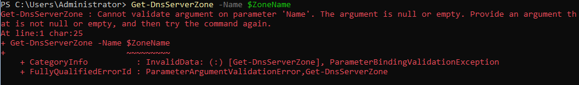
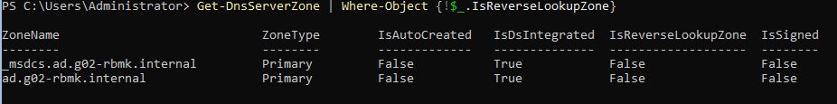
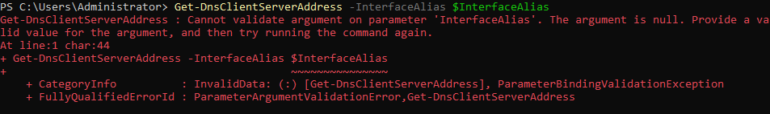

# Testrapport

- Uitvoerder test: Neal Joos
- Uitgevoerd op: 14/03/2024
- Github commit: ??

## Test: Is het DNS-installatiescript succesvol uitgevoerd?

Testprocedure:

1. Open een nieuw PowerShell-venster
2. Verander de working directory in PowerShell naar `sep2324-gent-g02\opdracht\VMs\windows\winserv1\scripts\DNS`.
3. Voer `.\winserv1-dns-config.ps1` uit in het PowerShell venster.

Verkregen resultaat:

- Ik heb dit script uitgevoerd op _winserv1_ in plaats van op mijn lokale machine.
- Het script werd voltooid zonder fouten.

<!-- Voeg hier eventueel een screenshot van het verkregen resultaat in. -->

Test geslaagd:

- [x] Ja
- [ ] Nee

Opmerkingen:

- /

## Test: Correcte installatie van DNS-forward-lookup?

Testprocedure:

1. Open een PowerShell-venster op de Windows-server waarop de DNS-service wordt geïnstalleerd.

2. Voer het volgende commando uit om forward lookup zone te controleren.

   ```powershell
   Get-DnsServerZone -Name $ZoneName
   ```

Verkregen resultaat:

- De uitvoer van het command `Get-Service -Name NTDS` geeft een foutmelding.

  

Test geslaagd:

- [ ] Ja
- [x] Nee

Opmerkingen:

- /

## Test: Correcte installatie van DNS-reverse-lookup?

Testprocedure:

1. Open een PowerShell-venster op de Windows-server waarop de DNS-service wordt geïnstalleerd.

2. Voer het volgende commando uit om forward lookup zone te controleren.

   ```powershell
   Get-DnsServerZone | Where-Object {!$_.IsReverseLookupZone}
   ```

Verkregen resultaat:

- De uitvoer van het command `Get-DnsServerZone | Where-Object {!$_.IsReverseLookupZone}` is gelijkaardig aan het verwachte resultaat.

  

Test geslaagd:

- [x] Ja
- [ ] Nee

Opmerkingen:

- /

## Test: Controleer de DNS-clientconfiguratie

Testprocedure:

1. Open een PowerShell-venster op de Windows-server waarop de DNS-service wordt geïnstalleerd.

2. Voer het volgende commando uit om de DNS-clientconfiguratie te controleren.

   ```powershell
   Get-DnsClientServerAddress -InterfaceAlias $InterfaceAlias
   ```

Verkregen resultaat:

- De uitvoer van `Get-DnsClientServerAddress -InterfaceAlias $InterfaceAlias` is niet gelijkaardig aan het verwachte resultaat.

  

Test geslaagd:

- [ ] Ja
- [x] Nee

Opmerkingen:

- /

## Test: Controleer de DNS-forwarders na configuratie

Testprocedure:

1. Open een PowerShell-venster op de Windows-server waarop de DNS-service wordt geïnstalleerd.

2. Voer het volgende commando uit om de geconfigureerde DNS-forwarders te controleren.
   ```powershell
   Get-DnsServerForwarder
   ```

Verkregen resultaat:

- De uitvoer van `Get-DnsServerForwarder` is identiek aan het verwachte resultaat.

Test geslaagd:

- [x] Ja
- [ ] Nee

Opmerkingen:

- /

## Test: Controleer de DNS-zones na herstart van de DNS-server

1. Open een PowerShell-venster op de SEP_Server.
2. Voer het volgende commando uit om de geconfigureerde DNS-zones te controleren:
   ```powershell
       Get-DnsServerZone
   ```

Verkregen resultaat:

- Alle DNS-zones worden correct weergegeven.

Test geslaagd:

- [x] Ja
- [ ] Nee

Opmerkingen:

- In de titel van deze test staat _na herstart_. Dit heb ik niet gedaan omdat dit niet in de stappen voor deze test stond. Het resultaat is wel het verwachtte resultaat.
