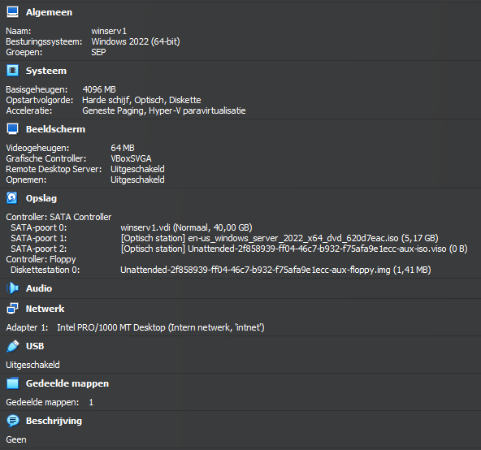
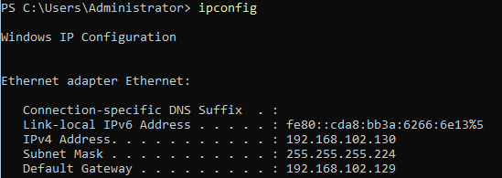
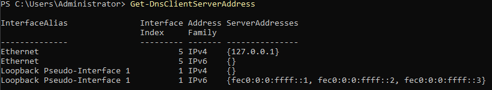

# Testplan

- Auteurs testplan: Neal Joos

## Test: Wordt de winserv1 VM correct geïnstalleerd?

Testprocedure:

1. Open een nieuw PowerShell-venster en open VirtualBox.
2. Verander de working directory in PowerShell naar `sep2324-gent-g02\opdracht\VMs\windows\winserv1\scripts`.
3. Voer `.\winserv1-init.ps1` uit in het PowerShell venster.
4. Er wordt gevraagd om _pathToIsoFile_ te definiëren. Geef het pad in van de Windows Server 2022 installatieschijf. Dit bestand dien je zelf te downloaden vanaf Academic Software.
5. Optioneel: als je het script al eerder uitvoerde, dien je aan te geven dat je de reeds bestaande VM wenst te overschrijven.

Verwacht resultaat:

- Script voltooid zonder foutmeldingen en de laatste lijn geeft weer dat de VM succesvol gestart is.

  ```powershell
  PS C:\Users\nealj\Documents\School\sep2324-gent-g02\opdrachten\VMs\windows\winserv1\scripts> .\winserv1-init.ps1 'c:\Users\nealj\Documents\ISOs\en-us_windows_server_2022_x64_dvd_620d7eac.iso'
  WARNING: The VM winserv1 already exists.
  If you continue, the existing VM will be overwritten.
  Do you want to continue? y/N: y
  0%...10%...20%...30%...40%...50%...60%...70%...80%...90%...100%
  Virtual machine 'winserv1' is created and registered.
  UUID: 2f858939-ff04-46c7-b932-f75afa9e1ecc
  Settings file: 'C:\Users\nealj\VirtualBox VMs\SEP\winserv1\winserv1.vbox'
  0%...10%...20%...30%...40%...50%...60%...70%...80%...90%...100%
  VBoxManage.exe: info: Preparing unattended installation of Windows2022_64 in machine 'winserv1' (2f858939-ff04-46c7-b932-f75afa9e1ecc).
  VBoxManage.exe: info: Using values:
                            isoPath = C:\Users\nealj\Documents\ISOs\en-us_windows_server_2022_x64_dvd_620d7eac.iso
                                user = Administrator
                            password = rbmk2324
                        fullUserName =
                          productKey = VDYBN-27WPP-V4HQT-9VMD4-VMK7H
                    additionsIsoPath = C:\Program Files\Oracle\VirtualBox/VBoxGuestAdditions.iso
              installGuestAdditions = true
                validationKitIsoPath =
              installTestExecService = false
                              locale = nl_BE
                            country = BE
                            timeZone = Europe/Brussels
                              proxy =
                            hostname = winserv1.g02-rbmk.internal
        packageSelectionAdjustments =
                  auxiliaryBasePath = C:\Users\nealj\VirtualBox VMs\SEP\winserv1\Unattended-2f858939-ff04-46c7-b932-f75afa9e1ecc-
                          imageIndex = 1
                  scriptTemplatePath = C:\Program Files\Oracle\VirtualBox\UnattendedTemplates\win_nt6_unattended.xml
      postInstallScriptTemplatePath = C:\Users\nealj\Documents\School\sep2324-gent-g02\opdrachten\VMs\windows\winserv1\scripts\winserv1-post-install.cmd
                  postInstallCommand =
        extraInstallKernelParameters =
                            language = en-US
                    detectedOSTypeId = Windows2022_64
                  detectedOSVersion = 10.0.20348.169
                    detectedOSFlavor = ServerStandard
                detectedOSLanguages = en-US
                    detectedOSHints =
                  detectedImage[0]* = #1: Windows Server 2022 Standard (10.0.20348.169 / x64 / en-US)
                    detectedImage[1] = #2: Windows Server 2022 Standard (Desktop Experience) (10.0.20348.169 / x64 / en-US)
                    detectedImage[2] = #3: Windows Server 2022 Datacenter (10.0.20348.169 / x64 / en-US)
                    detectedImage[3] = #4: Windows Server 2022 Datacenter (Desktop Experience) (10.0.20348.169 / x64 / en-US)
  VBoxManage.exe: info: VM 'winserv1' (2f858939-ff04-46c7-b932-f75afa9e1ecc) is ready to be started (e.g. VBoxManage startvm).
  Waiting for VM "winserv1" to power on...
  VM "winserv1" has been successfully started.
  ```

- Als er al een VM met de naam _winserv1_ bestaat, moet het script toestemming vragen om deze te mogen overschrijven. (zie bovenstaande output)
- De VM _winserv1_ is aangemaakt en start headless op.
- Buiten de stappen vermeld in de testprocedure, is er geen interactie van de gebruiker meer nodig en dient alles automatisch te verlopen.
- De VM reboot exact twee keer automatisch bij de eerste opstart.

<!-- Voeg hier eventueel een screenshot van het verwachte resultaat in. -->



## Test: Zijn de VirtualBox Guest Additions automatisch geïnstalleerd?

Testprocedure:

1. Open een nieuw PowerShell venster op de host.
2. Voeg het VirtualBox pad toe aan de padvariabele door volgend commando uit te voeren:

   ```powershell
   $env:PATH = $env:PATH + ";C:\Program Files\Oracle\VirtualBox"
   ```

3. Voer het volgende commando uit om de details van de _winserv1_ VM op te vragen.

   ```powershell
   VBoxManage.exe showvminfo winserv1
   ```

Verwacht resultaat:

- De output (van het laatste deel) dient gelijkaardig te zijn aan onderstaande output. Vooral _Additions run level_ dient de waarde 2 te hebben.

  ```powershell
   * Guest:
   Configured memory balloon:   0MB
   OS type:                     Windows10_64
   Additions run level:         2
   Additions version:           7.0.14 r161095
   Guest Facilities:
   Facility "VirtualBox Base Driver": active/running (last update: 2024/03/04 20:30:26 UTC)
   Facility "Auto Logon": active/running (last update: 2024/03/04 20:30:30 UTC)
   Facility "VirtualBox System Service": active/running (last update: 2024/03/04 20:30:28 UTC)
   Facility "VirtualBox Desktop Integration": failed (last update: 2024/03/04 20:32:13 UTC)
   Facility "Seamless Mode": not active (last update: 2024/03/04 20:30:42 UTC)
   Facility "Graphics Mode": not active (last update: 2024/03/04 20:30:26 UTC)
  ```

<!-- Voeg hier eventueel een screenshot van het verwachte resultaat in. -->

## Test: Is het IPv4-adres correct ingesteld?

Testprocedure:

1. Open een nieuw PowerShell venster in de _winserv1_ VM. Of kies optie 15 om SConfig te sluiten en een PowerShell venster weer te geven.
2. Voer het commando `ipconfig` uit.

Verwacht resultaat:

- Het IPv4-adres is `192.168.102.130`, de subnetmask is `255.255.255.224` en de default gateway is `192.168.102.129`.

  

## Test: Is de DNS-server juist ingesteld?

Testprocedure:

1. Open een nieuw PowerShell venster in de _winserv1_ VM. Of kies optie 15 om SConfig te sluiten en een PowerShell venster weer te geven.
2. Voer het commando `Get-DnsClientServerAddress` uit.

Verwacht resultaat:

- Het IPv4-serveradres is `127.0.0.1`.

  
