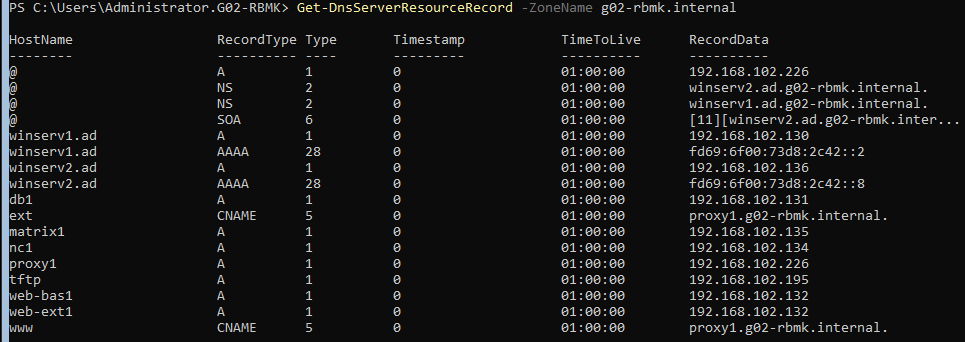

# Testplan

- Auteur(s) testplan: Maarten Adriaenssens

## Test: Controle op gelijkheid van data

Testprocedure:

1. voer volgend commando uit op **winserv1** `repadmin /replsummary winserv2`

Verwacht resultaat:

- Alle testen slagen, geen failures (zie screenshot)

<!-- Voeg hier eventueel een screenshot van het verwachte resultaat in. -->

### [Not correct](https://learn.microsoft.com/en-us/troubleshoot/windows-server/active-directory/replication-error-8524):

Als de resultaten niet overeenkomen met de screenshot voer volgend commando uit om de foutcode te achterhalen `repadmin /showrepl`

- Errorcode: 8524
  - test dns setup op beide servers met commando `dcdiag /test:dns /f:log.txt` (Kan enkele minunten duren)
  - ***Zorg dat dit gebeurt op C:\\***
  - Lees vervolgens logs `cat log.txt`

Check Active directory op beide server `repadmin /showrepl ad.g02-rbmk.internal`

- Alles zou succesvol moeten zijn

Fout ligt waarschijnlijk bij dns controlleer bij

- winserv1
  - Ethernet ipv4
    - eerst eigen dns, dan 2de dns -> {192.168.102.130, 192.168.102.136}
- winserv2
  - Ethernet ipv4
    - eerst eigen dns, dan 2de dns -> {192.168.102.136, 192.168.102.130}

## Test: controle op Organisational Units en User creation

Testprocedure:

1. Lijst alle OU's die te maken hebben met RBMK op via `Get-ADOrganizationalUnit -Filter * | Select-Object DistinguishedName,Name`
2. Lijst alle Users en hun enkele van hun parameters via `Get-ADUser -Filter * | Select-object DistinguishedName,Name,SamAccountName`

Verwacht resultaat:

- Resultaat zie screenshots

<!-- Voeg hier eventueel een screenshot van het verwachte resultaat in. -->

## Test: Controle op DNS forward lookup zones

1. Voer het volgende commando uit om forward lookup zone te controleren.

   `Get-DnsServerZone -Name ad.g02-rbmk.internal,g02-rbmk.internal`

Verwacht resultaat:

- Resultaat zie screenshots

<!-- Voeg hier eventueel een screenshot van het verwachte resultaat in. -->

## Test: Controle op DNS client configuratie

Testprocedure:

  1. Voer het volgende commando uit om de DNS-clientconfiguratie te controleren.

   `Get-DnsClientServerAddress -InterfaceAlias "Ethernet"`

Verwacht resultaat:

- Resultaat zie screenshots

<!-- Voeg hier eventueel een screenshot van het verwachte resultaat in. -->

## Test: Controle op DNS forwarders

Testprocedure:

  1. Voer het volgende commando uit om de geconfigureerde DNS-forwarders te controleren.

   `Get-DnsServerForwarder`

Verwacht resultaat:

- Resultaat zie screenshots
<!-- Voeg hier eventueel een screenshot van het verwachte resultaat in. -->

## Test: Controle op DNS reconrds in zones

Testprocedure:

  1. Voer het volgende commando uit om de geconfigureerde records te controleren.
   `Get-DnsServerResourceRecord -ZoneName ad.g02-rbmk.internal`

  2. Voer het volgende commando uit om de geconfigureerde records te controleren.
   `Get-DnsServerResourceRecord -ZoneName g02-rbmk.internal`

Verwacht resultaat:

- Resultaat zie screenshots

<!-- Voeg hier eventueel een screenshot van het verwachte resultaat in. -->

## Test: Controle op coorecte koppeling van DHCP op interface

Testprocedure:

1. Voer `Get-DhcpServerv4Binding` uit.

Verwacht resultaat:

- Resultaat zie screenshots

<!-- Voeg hier eventueel een screenshot van het verwachte resultaat in. -->

## Test: Controle op DHCP failover

Testprocedure:

1. Voer `Get-DhcpServerv4Failover` uit.
2. ...

Verwacht resultaat:

- Resultaat zie screenshots

<!-- Voeg hier eventueel een screenshot van het verwachte resultaat in. -->

## Test: Controle op DHCP Scope

Testprocedure:

1. Voer `Get-DhcpServerv4Scope` uit.

Verwacht resultaat:

- Resultaat zie screenshots

<!-- Voeg hier eventueel een screenshot van het verwachte resultaat in. -->

## Test: Controle op DHCP IPv4 en IPv6

Testprocedure:

1. Voer volgend commando uit `ipconfig /flushdns`
2. Test IPv4 voer volgende commando's uit op de winclient:
   - `ipconfig /release`
   - `ipconfig /renew`
3. Test IPv6 voer volgende commando's uit op de winclient:
   - `ipconfig /release6`
   - `ipconfig /renew6`
4. Voer volgend commando uit `ipconfig /all`
5. Voer volgend commando uit `ipconfig /displaydns`

Verwacht resultaat:

- DNS cache wordt geflushed
- IPv4 wordt vernieuwd
- IPv6 wordt vernieuwd
- DNS bevat de 4 dns addressen

<!-- Voeg hier eventueel een screenshot van het verwachte resultaat in. -->
