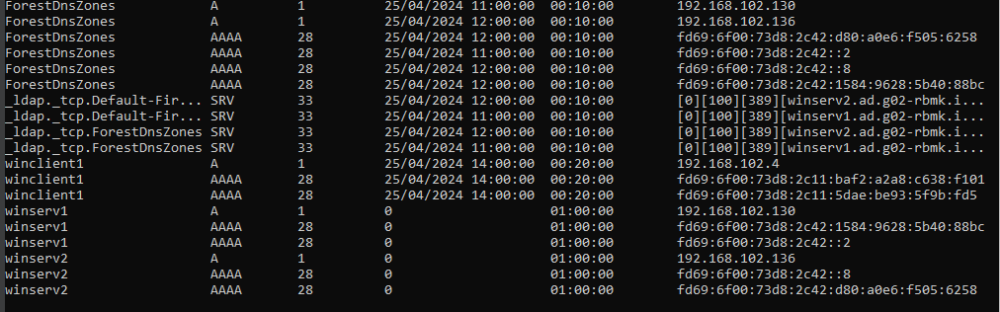

# Testrapport

- Uitvoerder(s) test: Wout De Temmerman
- Uitgevoerd op: 25/04/2024
- Github commit: 70de06

## Test: Controle op gelijkheid van data

Testprocedure:

1. voer volgend commando uit op **winserv1** `repadmin /replsummary winserv2`

Verkregen resultaat:

- zie screenshot

<!-- Voeg hier eventueel een screenshot van het verkregen resultaat in. -->

Test geslaagd:

- [x] Ja
- [ ] Nee

## Test: controle op Organisational Units en User creation

Testprocedure:

1. Lijst alle OU's die te maken hebben met RBMK op via `Get-ADOrganizationalUnit -Filter * | Select-Object DistinguishedName,Name`
2. Lijst alle Users en hun enkele van hun parameters via `Get-ADUser -Filter * | Select-object DistinguishedName,Name,SamAccountName`

Verkregen resultaat:

- Resultaat zie screenshots

<!-- Voeg hier eventueel een screenshot van het verkregen resultaat in. -->

Test geslaagd:

- [x] Ja
- [ ] Nee

## Test: Controle op DNS forward lookup zones

1. Voer het volgende commando uit om forward lookup zone te controleren.

   `Get-DnsServerZone -Name ad.g02-rbmk.internal,g02-rbmk.internal`

Verkregen resultaat:

- Resultaat zie screenshots

<!-- Voeg hier eventueel een screenshot van het verkregen resultaat in. -->

Test geslaagd:

- [x] Ja
- [ ] Nee

## Test: Controle op DNS client configuratie

Testprocedure:

  1. Voer het volgende commando uit om de DNS-clientconfiguratie te controleren.

   `Get-DnsClientServerAddress -InterfaceAlias "Ethernet"`

Verkregen resultaat:

- Resultaat zie screenshots

<!-- Voeg hier eventueel een screenshot van het verkregen resultaat in. -->

Test geslaagd:

- [x] Ja
- [ ] Nee

## Test: Controle op DNS forwarders

Testprocedure:

  1. Voer het volgende commando uit om de geconfigureerde DNS-forwarders te controleren.

   `Get-DnsServerForwarder`

Verkregen resultaat:

- Resultaat zie screenshots

<!-- Voeg hier eventueel een screenshot van het verkregen resultaat in. -->

Test geslaagd:

- [x] Ja
- [ ] Nee

## Test: Controle op DNS reconrds in zones

Testprocedure:

  1. Voer het volgende commando uit om de geconfigureerde records te controleren.
   `Get-DnsServerResourceRecord -ZoneName ad.g02-rbmk.internal`

  2. Voer het volgende commando uit om de geconfigureerde records te controleren.
   `Get-DnsServerResourceRecord -ZoneName g02-rbmk.internal`

Verkregen resultaat:

- Resultaat zie screenshots

<!-- Voeg hier eventueel een screenshot van het verkregen resultaat in. -->

Test geslaagd:

- [x] Ja
- [ ] Nee

## Test: Controle op coorecte koppeling van DHCP op interface

Testprocedure:

1. Voer `Get-DhcpServerv4Binding` uit.

Verkregen resultaat:

- Resultaat zie screenshots

<!-- Voeg hier eventueel een screenshot van het verkregen resultaat in. -->

Test geslaagd:

- [x] Ja
- [ ] Nee

## Test: Controle op DHCP failover

Testprocedure:

1. Voer `Get-DhcpServerv4Failover` uit.
2. ...

Verkregen resultaat:

- Resultaat zie screenshots

<!-- Voeg hier eventueel een screenshot van het verkregen resultaat in. -->

Test geslaagd:

- [x] Ja
- [ ] Nee

## Test: Controle op DHCP Scope

Testprocedure:

1. Voer `Get-DhcpServerv4Scope` uit.

Verkregen resultaat:

- Resultaat zie screenshots

<!-- Voeg hier eventueel een screenshot van het verkregen resultaat in. -->

Test geslaagd:

- [x] Ja
- [ ] Nee

## Test: Controle op coorecte koppeling van DHCPv6 op interface

Testprocedure:

1. Voer `Get-DhcpServerv6Binding` uit.

Verkregen resultaat:

- Resultaat zie screenshots

<!-- Voeg hier eventueel een screenshot van het verkregen resultaat in. -->

Test geslaagd:

- [x] Ja
- [ ] Nee

## Test: Controle op DHCPv6 Scope

Testprocedure:

1. Voer `Get-DhcpServerv6Scope` uit.

Verkregen resultaat:

- Resultaat zie screenshots

<!-- Voeg hier eventueel een screenshot van het verkregen resultaat in. -->

Test geslaagd:

- [x] Ja
- [ ] Nee

## Test: Controle op DHCP IPv4 en IPv6

Testprocedure:

1. Voer volgend commando uit `ipconfig /flushdns`
2. Test IPv4 voer volgende commando's uit op de winclient:
   - `ipconfig /release`
   - `ipconfig /renew`
3. Test IPv6 voer volgende commando's uit op de winclient:
   - `ipconfig /release6`
   - `ipconfig /renew6`
4. Voer volgend commando uit `ipconfig /all`
5. Voer volgend commando uit `ipconfig /displaydns`

Verkregen resultaat:

- DNS cache wordt geflushed
- IPv4 wordt vernieuwd
- IPv6 wordt vernieuwd
- DNS bevat de 4 dns addressen

<!-- Voeg hier eventueel een screenshot van het verkregen resultaat in. -->

Test geslaagd:

- [x] Ja
- [ ] Nee