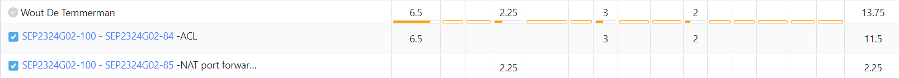

# Opvolgingsrapport week 11 tot 12

## Algemeen

- Groep: G02
- Periode: 2/05/2024 tot 15/05/2024
- Datum voortgangsgesprek: 16/05/2024

| Student              | Afw. | Opmerking |
| :------------------- | :--: | :-------- |
| Xander Dheedene      |      |           |
| Neal Joos            |      |           |
| Wout De Temmerman    |      |           |
| Maarten Adriaenssens |      |           |
| Tariq Asifi          |      |           |

## Wat heb je deze periode gerealiseerd?

### Algemeen

- Afwerken en algemene testing

### KanBan

<!-- Voeg hier een screenshot toe van de huidige toestand van het kanban bord. -->

### Tijdsregistratie

<!-- Voeg hier een screenshot toe van het teamoverzicht van de tijdregistratie, met totaal per student en team -->

### Cumulatief flow diagram

<!-- Voeg hier een screenshot toe van het cumulatief flow diagram voor de periode van het rapport. -->

**Overzicht rapporteringsperiode W10:**

<!-- Voeg hier een screenshot toe van het cumulatief flow diagram voor de volledige periode van het project. -->

**Algemeen overzicht:**

### Student 1: Xander Dheedene

<!-- Voeg hier een overzicht toe van gerealiseerde taken inclusief links naar relevante commits/documenten. -->

- 

[Link naar commits](https://github.com/HoGentTIN/sep2324-gent-g02/commits/linux-vagrant/?author=XanderDheedene&since=2024-03-22&until=2024-05-2)

<!-- Voeg hier een screenshot van het individueel tijdregistratierapport, met overzicht van elke taak en bijhorende uren. -->

### Student 2: Neal Joos

<!-- Voeg hier een overzicht toe van gerealiseerde taken inclusief links naar relevante commits/documenten. -->

- 

[Link naar commits in main branch](https://github.com/HoGentTIN/sep2324-gent-g02/commits/main?author=nealjoos&since=2024-03-22&until=2024-05-02)

<!-- Voeg hier een screenshot van het individueel tijdregistratierapport, met overzicht van elke taak en bijhorende uren. -->

### Student 3: Wout De Temmerman

<!-- Voeg hier een overzicht toe van gerealiseerde taken inclusief links naar relevante commits/documenten. -->

- 

<!-- Voeg hier een screenshot van het individueel tijdregistratierapport, met overzicht van elke taak en bijhorende uren. -->

### Student 4: Maarten Adriaenssens

<!-- Voeg hier een overzicht toe van gerealiseerde taken inclusief links naar relevante commits/documenten. -->

- Algemeen helpen
- planning opstellen met team
- administratie

[Commits van Maarten Adriaenssens](https://github.com/HoGentTIN/sep2324-gent-g02/commits/main/?author=Maarten-Adriaenssens)

<!-- Voeg hier een screenshot van het individueel tijdregistratierapport, met overzicht van elke taak en bijhorende uren. -->

### Student 5: Tariq Asifi

<!-- Voeg hier een overzicht toe van gerealiseerde taken inclusief links naar relevante commits/documenten. -->

- 

[Link naar commits in main branch](https://github.com/HoGentTIN/sep2324-gent-g02/commits/?author=tariqasifi)

<!-- Voeg hier een screenshot van het individueel tijdregistratierapport, met overzicht van elke taak en bijhorende uren. -->

## Total TimeLogging overview

## Retrospectieve

### Wat doen jullie goed?

<!-- Voeg hier zaken toe die jullie goed doen naar het proces toe. -->

- Vlotte samenwerken
- Elkaar helpen

### Waar hebben jullie nog problemen mee?

<!-- Voeg hier zaken toe die volgens jullie beter kunnen naar het proces toe. -->

- /

### Feedback

#### Groep

#### Student 1

#### Student 2

#### Student 3

#### Student 4

#### Student 5
