# Opvolgingsrapport 4

## Algemeen

- Groep: G02
- Periode: 22/02/2024 tot 7/03/2024
- Datum voortgangsgesprek: 7/03/2024

| Student              | Afw. | Opmerking |
| :------------------- | :--: | :-------- |
| Xander Dheedene      |      |           |
| Neal Joos            |      |           |
| Wout De Temmerman    |      |           |
| Maarten Adriaenssens |      |           |
| Tariq Asifi          |      |           |

## Wat heb je deze periode gerealiseerd?

### Algemeen

- Eerste samenzitting.
- Grote lijnen van het project op elkaar afgesteld.
- Offerte overleg
- ...

#### KanBan

<!-- Voeg hier een screenshot toe van de huidige toestand van het kanban bord. -->

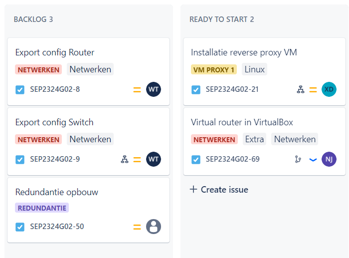
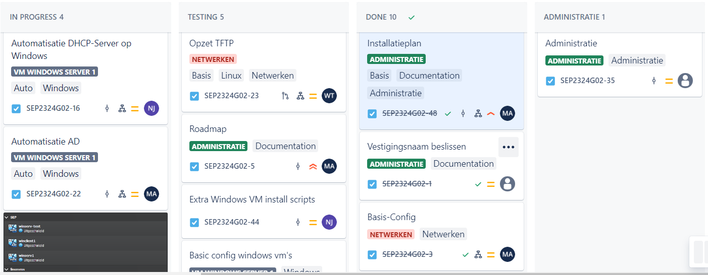
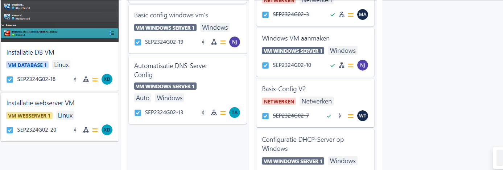
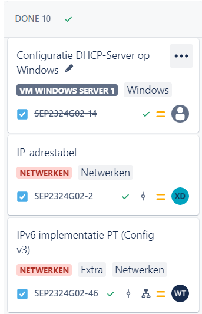
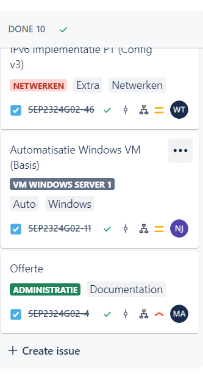

#### Tijdsregistratie

<!-- Voeg hier een screenshot toe van het teamoverzicht van de tijdregistratie, met totaal per student en team -->

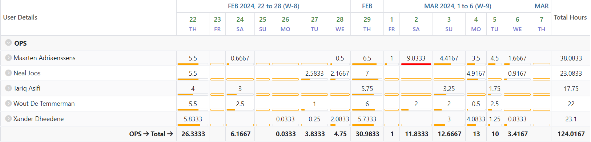

#### Cumulatief flow diagram

<!-- Voeg hier een screenshot toe van het cumulatief flow diagram voor de periode van het rapport. -->

Overzicht rapporteringsperiode:

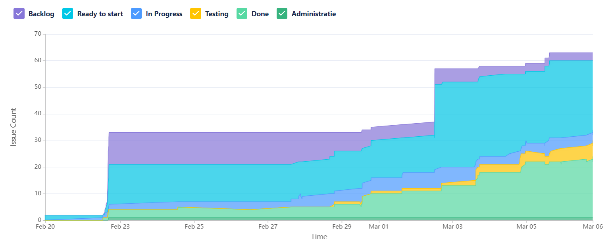

<!-- Voeg hier een screenshot toe van het cumulatief flow diagram voor de volledige periode van het project. -->

Algemeen overzicht:

### Student 1: Xander Dheedene

<!-- Voeg hier een overzicht toe van gerealiseerde taken inclusief links naar relevante commits/documenten. -->

- [IP-tabel](../opdrachten/IP-adrestabel.md) opstellen
- Packettracer DHCP oplossen [commit](https://github.com/HoGentTIN/sep2324-gent-g02/commit/b1cf1c52b2fa520f73d9b59b94f3d2efef041181)
- Wordpress automatisatie [commit](https://github.com/HoGentTIN/sep2324-gent-g02/commit/51aa26d221a709133160986b0f7cd338b74bb427)
- Database automatisatie (inbegrepen met webserver)
- Offerte

<!-- Voeg hier een screenshot van het individueel tijdregistratierapport, met overzicht van elke taak en bijhorende uren. -->

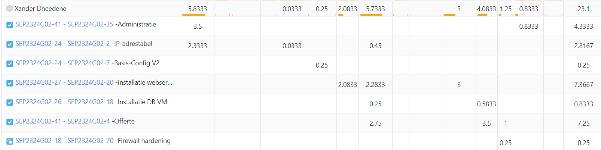

### Student 2: Neal Joos

<!-- Voeg hier een overzicht toe van gerealiseerde taken inclusief links naar relevante commits/documenten. -->

- Automatisch aanmaken en installeren van een Windows Server VM
- Automatisatie basisconfiguratie Windows Server VM (automatsich instellen IP-adres, DNS-servers, ...)
- Script voor het automatisch installeren van een DHCP-server op Windows Server
- Opmaken offerte (in groep)

[Link naar commits](https://github.com/HoGentTIN/sep2324-gent-g02/commits/main/?author=nealjoos&since=2024-02-20&until=2024-03-06)

<!-- Voeg hier een screenshot van het individueel tijdregistratierapport, met overzicht van elke taak en bijhorende uren. -->

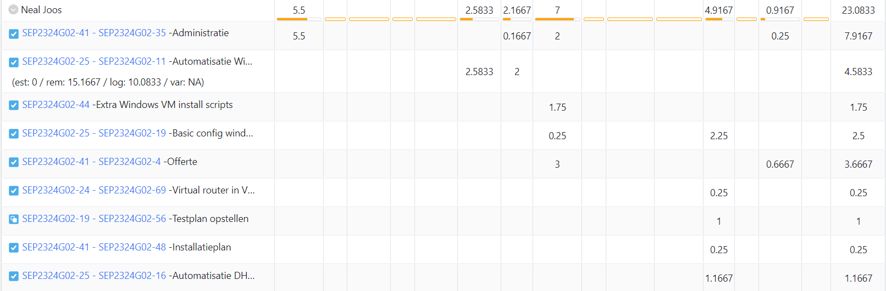

### Student 3: Wout De Temmerman

<!-- Voeg hier een overzicht toe van gerealiseerde taken inclusief links naar relevante commits/documenten. -->

- Packettracer configuratie routers en switches
- Packettracer dhcp configuratie
- Packettracer implementatie ipv6
- Aanpassingen IP-Tabel (kleine foutjes uithalen)
- Opzet en config tftp-server
- Automatisatie via vagrant voor tftp-server
- Opmaken offerte (in groep)

<!-- Voeg hier een screenshot van het individueel tijdregistratierapport, met overzicht van elke taak en bijhorende uren. -->

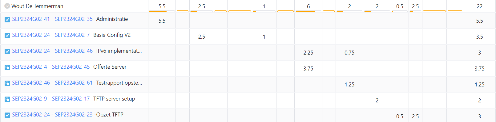

### Student 4: Maarten Adriaenssens

<!-- Voeg hier een overzicht toe van gerealiseerde taken inclusief links naar relevante commits/documenten. -->

- voorbereidend onderzoek vagrant (Client-side)
- algemene controle IP-tabel
- Controle Netwerk / Packettracer [8729bda](https://github.com/HoGentTIN/sep2324-gent-g02/commit/8729bda817b56539edc14c3a592ce6a1b6fbc5ef) & [fc56202](https://github.com/HoGentTIN/sep2324-gent-g02/commit/fc56202a945679d02f920c8f092f3192f5c5648c)
- Voorbereiding / aanvulling rapport [88cd11](https://github.com/HoGentTIN/sep2324-gent-g02/commit/88cd11ca6ba95d26453cbabab922f6d22e5b6250) & [dcddeab](https://github.com/HoGentTIN/sep2324-gent-g02/commit/dcddeabe579b4b7eb61d6af3f35780d3f501d17a)
- Algemene Documentatie
- Offerte
- Installatieplan en -schema
- Script autodeploy Active Directory [SEP2324G02-22-Automatische-AD Branch](https://github.com/HoGentTIN/sep2324-gent-g02/tree/SEP2324G02-22-Automatisatie-AD)
- Controle Scripting winServ1 [74ccb00](https://github.com/HoGentTIN/sep2324-gent-g02/commit/74ccb007c8cfc44ac4e948bc7c8d72be74760dc6)

<!-- Voeg hier een screenshot van het individueel tijdregistratierapport, met overzicht van elke taak en bijhorende uren. -->

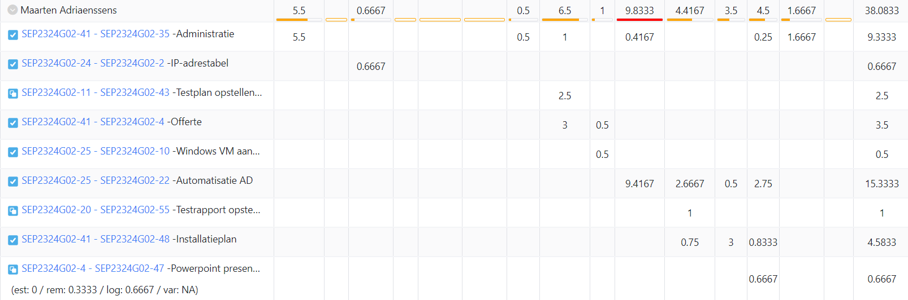

### Student 5: Tariq Asifi

<!-- Voeg hier een overzicht toe van gerealiseerde taken inclusief links naar relevante commits/documenten. -->

- Voorbereiding script vm aanmaken
- Script testen
- Installeren vm via script
- Dns server installeren en configureren met script

<!-- Voeg hier een screenshot van het individueel tijdregistratierapport, met overzicht van elke taak en bijhorende uren. -->

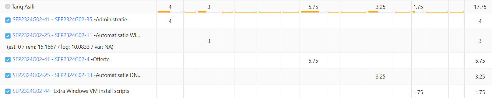

## Wat plan je volgende periode te doen?

### Algemeen

<!-- Voeg hier de doelstellingen toe voor volgende periode. -->

- Roadmap herevalueren (haalbaarheid) en verder aanvullen (deel 2 project REDUNDANTIE)
- Services integreren en testen op een fysiek netwerk

### Student 1: Xander Dheedene

<!-- Voeg hier de individuele doelstellingen toe voor volgende periode. -->

- Hardening van de firewall op linux VMs
- Proxy server

### Student 2: Neal Joos

<!-- Voeg hier de individuele doelstellingen toe voor volgende periode. -->

- Bespreken en al dan niet uitrollen virtueel netwerk in VirtualBox
- Testen automatisch script Active Directory
- Testen automatisch script DNS-server
- Verder aanvullen script DHCP-server (waar nodig)

### Student 3: Wout De Temmerman

<!-- Voeg hier de individuele doelstellingen toe voor volgende periode. -->

- Uittesten van tftp server
- Controle van switch en router config op fysieke toestellen
- Export van configuratie van router en switches om op tftp server te plaatsen
- Start aan redundantie voor de routers (HSRP) 

### Student 4: Maarten Adriaenssens

<!-- Voeg hier de individuele doelstellingen toe voor volgende periode. -->

- Exporten configuratie router
- Afwerken Active Directory
- Meer testen
- Documentatie

### Student 5: Tariq Asifi

<!-- Voeg hier de individuele doelstellingen toe voor volgende periode. -->

- Script VM installatie Windows Server
- Script DNS server

## Retrospectieve

### Wat doen jullie goed?

<!-- Voeg hier zaken toe die jullie goed doen naar het proces toe. -->

- Vlotte communcatie
- Goede ondersteuning aan elkaar

### Waar hebben jullie nog problemen mee?

<!-- Voeg hier zaken toe die volgens jullie beter kunnen naar het proces toe. -->

- Elke commit linken aan Jira
- ...

### Feedback

#### Groep

#### Student 1

#### Student 2

#### Student 3

#### Student 4

#### Student 5
