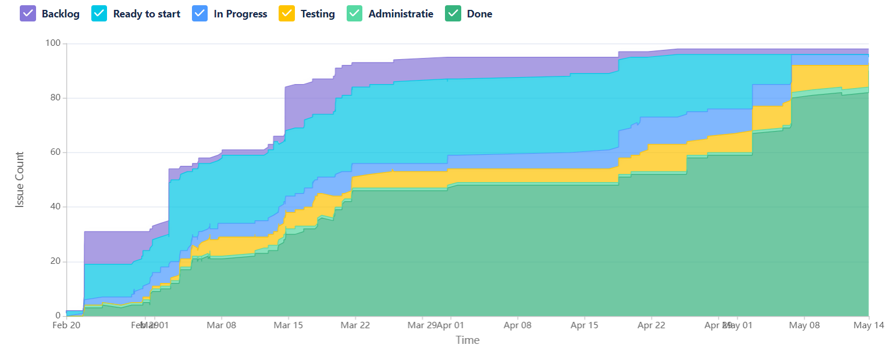

# Opvolgingsrapport 4

## Algemeen

- Groep: G02
- Periode: 08/03/2024 tot 21/03/2024
- Datum voortgangsgesprek: 21/03/2024

| Student              | Afw. | Opmerking |
| :------------------- | :--: | :-------- |
| Xander Dheedene      |      |           |
| Neal Joos            |      |           |
| Wout De Temmerman    |      |           |
| Maarten Adriaenssens |      |           |
| Tariq Asifi          |      |           |

## Wat heb je deze periode gerealiseerd?

### Algemeen

- ...

#### KanBan

<!-- Voeg hier een screenshot toe van de huidige toestand van het kanban bord. -->

#### Tijdsregistratie

<!-- Voeg hier een screenshot toe van het teamoverzicht van de tijdregistratie, met totaal per student en team -->

#### Cumulatief flow diagram

<!-- Voeg hier een screenshot toe van het cumulatief flow diagram voor de periode van het rapport. -->

Overzicht rapporteringsperiode:

<!-- Voeg hier een screenshot toe van het cumulatief flow diagram voor de volledige periode van het project. -->

Algemeen overzicht:

### Student 1: Xander Dheedene

<!-- Voeg hier een overzicht toe van gerealiseerde taken inclusief links naar relevante commits/documenten. -->

- Virtual router aangemaakt om proxy te kunnen testen
- Ssh-key aan db & web VM toevoegen
- Linux VMs netwerken aanpassen om eindproduct na te bootsen
- Reverse proxy over HTTPS
- Start meerdere testplannen voor reverse proxy

[Link naar commits](https://github.com/HoGentTIN/sep2324-gent-g02/commits/linux-vagrant/?author=XanderDheedene&since=2024-03-06&until=2024-03-20)

<!-- Voeg hier een screenshot van het individueel tijdregistratierapport, met overzicht van elke taak en bijhorende uren. -->

### Student 2: Neal Joos

<!-- Voeg hier een overzicht toe van gerealiseerde taken inclusief links naar relevante commits/documenten. -->

- Testplan winserv1 aangepast
- Testplan winclient1 aangepast
- Opkuis Windows VM's en mappenstructuur geoptimaliseerd samen met [Maarten Adriaenssens](#student-4-maarten-adriaenssens)
- Script voor virtuele router via Vagrant
- Testrapport automatisatie Active Directory
- Testen toevoegen winclient1 in Active Directory
- Script voor automatisch aanmaken van SMB-shares
- Script voor aanmaken DHCP-server op winserv1
- Testrapport configuratie DHCP-server op winserv1
- Optimaliseren en debuggen DNS configuratie script voor winserv1

[Link naar commits in main branch](https://github.com/HoGentTIN/sep2324-gent-g02/commits/main?author=nealjoos&since=2024-03-07&until=2024-03-21)

<!-- Voeg hier een screenshot van het individueel tijdregistratierapport, met overzicht van elke taak en bijhorende uren. -->

### Student 3: Wout De Temmerman

<!-- Voeg hier een overzicht toe van gerealiseerde taken inclusief links naar relevante commits/documenten. -->

- Nieuwe versie van pt gemaakt waar redundantie in verwerkt is
- HSRP voor routers uitgewerkt
- Kleine aanpassing IP-tabel
- Aanmaak achtergrond voor Windows-Clients
- Redundantie uitgewerkt voor dhcp binnen PT en Fysiek
- Samengezeten met team voor uitwerking GPO's
- Eerste versies voor config-files aangemaakt om in TFTP te zetten

<!-- Voeg hier een screenshot van het individueel tijdregistratierapport, met overzicht van elke taak en bijhorende uren. -->

### Student 4: Maarten Adriaenssens

<!-- Voeg hier een overzicht toe van gerealiseerde taken inclusief links naar relevante commits/documenten. -->

- Afgewerkt Autodeployment Active Directory ([Jira Active Directory](https://sep2324-gent-g02.atlassian.net/jira/software/projects/SEP2324G02/boards/1?selectedIssue=SEP2324G02-22))
- Opstellen en controleren van testplan voor Active Directory ([Jira Testplan Active Directory](https://sep2324-gent-g02.atlassian.net/jira/software/projects/SEP2324G02/boards/1?selectedIssue=SEP2324G02-52))
- Controle op testplan TFTP ([a354bd8](https://github.com/HoGentTIN/sep2324-gent-g02/commit/a354bd8c3072fe9dff9bf72520637c3d23c1c897)) en controle op pullrequest & merge van TFTP branch ([39a79f](https://github.com/HoGentTIN/sep2324-gent-g02/commit/39a79f1ffdfbc0c1f8afa3a9a27a3efe20853ac7))
- General cleanup van github samen met [Neal Joos](#student-2-neal-joos)
- Testrapporten
- Documentatie aanvullen

[Commits van Maarten Adriaenssens](https://github.com/HoGentTIN/sep2324-gent-g02/commits/main/?author=Maarten-Adriaenssens)

<!-- Voeg hier een screenshot van het individueel tijdregistratierapport, met overzicht van elke taak en bijhorende uren. -->

### Student 5: Tariq Asifi

<!-- Voeg hier een overzicht toe van gerealiseerde taken inclusief links naar relevante commits/documenten. -->

- Testplan Dns server gemaakt 
- Dns configuratie aangepast
- Testrapport dns aangepast na testraport 
- dns configuratie idempotent gemaakt
- probleem met Winserver CLI installatie op mijn vm opgelost
- dns configuratie getest + test rapport opnieuw aangepast

[Link naar commits in main branch](https://github.com/HoGentTIN/sep2324-gent-g02/commits/?author=tariqasifi)

<!-- Voeg hier een screenshot van het individueel tijdregistratierapport, met overzicht van elke taak en bijhorende uren. -->

## Wat plan je volgende periode te doen?

### Algemeen

<!-- Voeg hier de doelstellingen toe voor volgende periode. -->

- Kanban verder volgen

### Student 1: Xander Dheedene

<!-- Voeg hier de individuele doelstellingen toe voor volgende periode. -->

- Testplan(nen) proxy afwerken
- Linux scripts idempotent maken
- Algemene testen van winserv1

### Student 2: Neal Joos

<!-- Voeg hier de individuele doelstellingen toe voor volgende periode. -->

- Testen DHCP server op fysiek netwerk
- Testen en afwerken DNS
- Certificate Authority uitrollen
- GPO's uitrollen
- IPv6 op winserv1 uitrollen

### Student 3: Wout De Temmerman

<!-- Voeg hier de individuele doelstellingen toe voor volgende periode. -->

- TFTP test binnen fysiek netwerk
- router config voor PT uitbreiden (HSRP en subinterfaces)
- controle van geëxporteerde config voor switch en router

### Student 4: Maarten Adriaenssens

<!-- Voeg hier de individuele doelstellingen toe voor volgende periode. -->

- Verdere stappen ondernemen voor Active Directory
- Beginnen aan uitbreidingen
- Testen van DNS
- Testopstelling testen

### Student 5: Tariq Asifi

<!-- Voeg hier de individuele doelstellingen toe voor volgende periode. -->

- testen van tft netwerk
- dns ipv6 records maken 
- testplan opstellen voor dns ipv6 records

## Retrospectieve

### Wat doen jullie goed?

<!-- Voeg hier zaken toe die jullie goed doen naar het proces toe. -->

- Vlotte samenwerken
- Elkaar helpen

### Waar hebben jullie nog problemen mee?

<!-- Voeg hier zaken toe die volgens jullie beter kunnen naar het proces toe. -->

- /

### Feedback

#### Groep

#### Student 1

#### Student 2

#### Student 3

#### Student 4

#### Student 5
