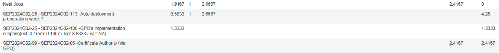

# Opvolgingsrapport week 8 tot 10

## Algemeen

- Groep: G02
- Periode: 22/03/2024 tot 2/05/2024
- Datum voortgangsgesprek: 2/05/2024

| Student              | Afw. | Opmerking |
| :------------------- | :--: | :-------- |
| Xander Dheedene      |      |           |
| Neal Joos            |      |           |
| Wout De Temmerman    |      |           |
| Maarten Adriaenssens |      |           |
| Tariq Asifi          |      |           |

## Wat heb je deze periode gerealiseerd?

### Algemeen

- Pauze in paasvakantie, onderzoek
- Algemeen afrondingsfase gestart

### KanBan

<!-- Voeg hier een screenshot toe van de huidige toestand van het kanban bord. -->

**Week 8**

**Week 9**

**Week 10**

### Tijdsregistratie

<!-- Voeg hier een screenshot toe van het teamoverzicht van de tijdregistratie, met totaal per student en team -->

**Algemeen tijdsoverzicht W8**

**Algemeen tijdsoverzicht W9**

**Algemeen tijdsoverzicht W10**

### Cumulatief flow diagram

<!-- Voeg hier een screenshot toe van het cumulatief flow diagram voor de periode van het rapport. -->

**Overzicht rapporteringsperiode W8:**

**Overzicht rapporteringsperiode W9:**

**Overzicht rapporteringsperiode W10:**

<!-- Voeg hier een screenshot toe van het cumulatief flow diagram voor de volledige periode van het project. -->

**Algemeen overzicht:**

### Student 1: Xander Dheedene

<!-- Voeg hier een overzicht toe van gerealiseerde taken inclusief links naar relevante commits/documenten. -->

- Onderzoek waarom web/proxy niet werkten in de demo maar wel in test omgeving.
- Herstructurering van code voor linux VMs
- Nextcloud
- IPv6 linux VMs
- Extra webserver
- Start reverse proxy hardening

[Link naar commits](https://github.com/HoGentTIN/sep2324-gent-g02/commits/linux-vagrant/?author=XanderDheedene&since=2024-03-22&until=2024-05-2)

<!-- Voeg hier een screenshot van het individueel tijdregistratierapport, met overzicht van elke taak en bijhorende uren. -->

### Student 2: Neal Joos

<!-- Voeg hier een overzicht toe van gerealiseerde taken inclusief links naar relevante commits/documenten. -->

- GPO's geupdate
- Kleine fouten in shares script aangepast
- Kleine optimalisaties & code cleanup
- Certificate Authority op _winserv1_

[Link naar commits in main branch](https://github.com/HoGentTIN/sep2324-gent-g02/commits/main?author=nealjoos&since=2024-03-22&until=2024-05-02)

<!-- Voeg hier een screenshot van het individueel tijdregistratierapport, met overzicht van elke taak en bijhorende uren. -->

### Student 3: Wout De Temmerman

<!-- Voeg hier een overzicht toe van gerealiseerde taken inclusief links naar relevante commits/documenten. -->

- Netwerk klaargemaakt voor gebruik ipv6
- Nieuwe versie voor opstelling van netwerk aangemaakt
- NAT en begin ACL teogevoegd aan config-files
- Afwerking ACL's
- Extra security features aan config toegevoegd
- Begonnen aan nat

<!-- Voeg hier een screenshot van het individueel tijdregistratierapport, met overzicht van elke taak en bijhorende uren. -->

### Student 4: Maarten Adriaenssens

<!-- Voeg hier een overzicht toe van gerealiseerde taken inclusief links naar relevante commits/documenten. -->

- Onderzoek naar 2de Domeincontroller
- Creatie winserv2
- DHCPv6
- IPv6
- Starting Testplannen update
- Anderen helpen

[Commits van Maarten Adriaenssens](https://github.com/HoGentTIN/sep2324-gent-g02/commits/main/?author=Maarten-Adriaenssens)

<!-- Voeg hier een screenshot van het individueel tijdregistratierapport, met overzicht van elke taak en bijhorende uren. -->

### Student 5: Tariq Asifi

<!-- Voeg hier een overzicht toe van gerealiseerde taken inclusief links naar relevante commits/documenten. -->

- Installeer Synapse server
- user accounts aanmaken op de matrix server(samen met [Xander](#student-1-xander-dheedene))
- Bash script op de webserver dat een bericht stuurt naar een matrix.org room als de webserver afsluit

[Link naar commits in main branch](https://github.com/HoGentTIN/sep2324-gent-g02/commits/?author=tariqasifi)

<!-- Voeg hier een screenshot van het individueel tijdregistratierapport, met overzicht van elke taak en bijhorende uren. -->

## Wat plan je volgende periode te doen?

### Algemeen

<!-- Voeg hier de doelstellingen toe voor volgende periode. -->

- Kanban verder volgen
- Testplannen updaten

### Student 1: Xander Dheedene

<!-- Voeg hier de individuele doelstellingen toe voor volgende periode. -->

- Extra website loadbalancen
- Reverse proxy hardening
- Testplannen maken

### Student 2: Neal Joos

<!-- Voeg hier de individuele doelstellingen toe voor volgende periode. -->

- Certificaten geautomatiseerd uitrollen via Windows Server 1

### Student 3: Wout De Temmerman

<!-- Voeg hier de individuele doelstellingen toe voor volgende periode. -->

- Nat volledig doen werken
- ACL's compleet
- OPzoekwerk evnetuele implementatie honeypot in netwerk

### Student 4: Maarten Adriaenssens

<!-- Voeg hier de individuele doelstellingen toe voor volgende periode. -->

- Grote update naar testplannen
- Samenzitten met groep en eindfase starten

### Student 5: Tariq Asifi

<!-- Voeg hier de individuele doelstellingen toe voor volgende periode. -->

- uitvoer van geëncrypteerd gesprek.
- Installeer een bridge naar een extern chatplatform
- Testen van de matrix server

## Retrospectieve

### Wat doen jullie goed?

<!-- Voeg hier zaken toe die jullie goed doen naar het proces toe. -->

- Vlotte samenwerken
- Elkaar helpen

### Waar hebben jullie nog problemen mee?

<!-- Voeg hier zaken toe die volgens jullie beter kunnen naar het proces toe. -->

- /

### Feedback

#### Groep

#### Student 1

#### Student 2

#### Student 3

#### Student 4

#### Student 5
